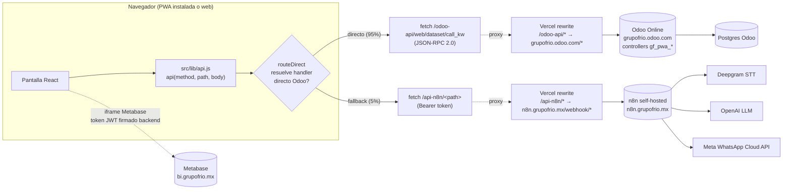
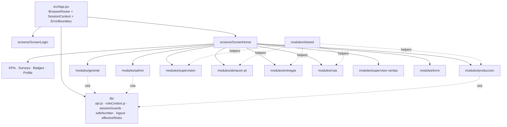
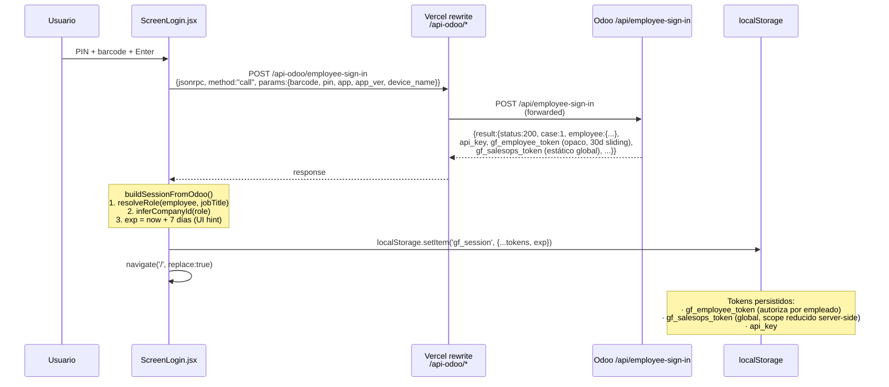
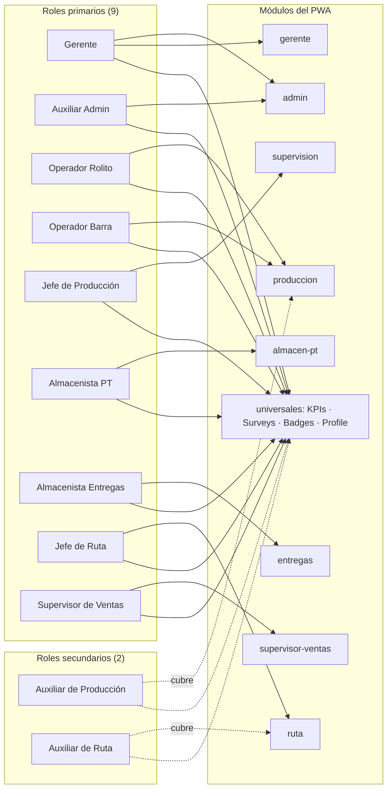
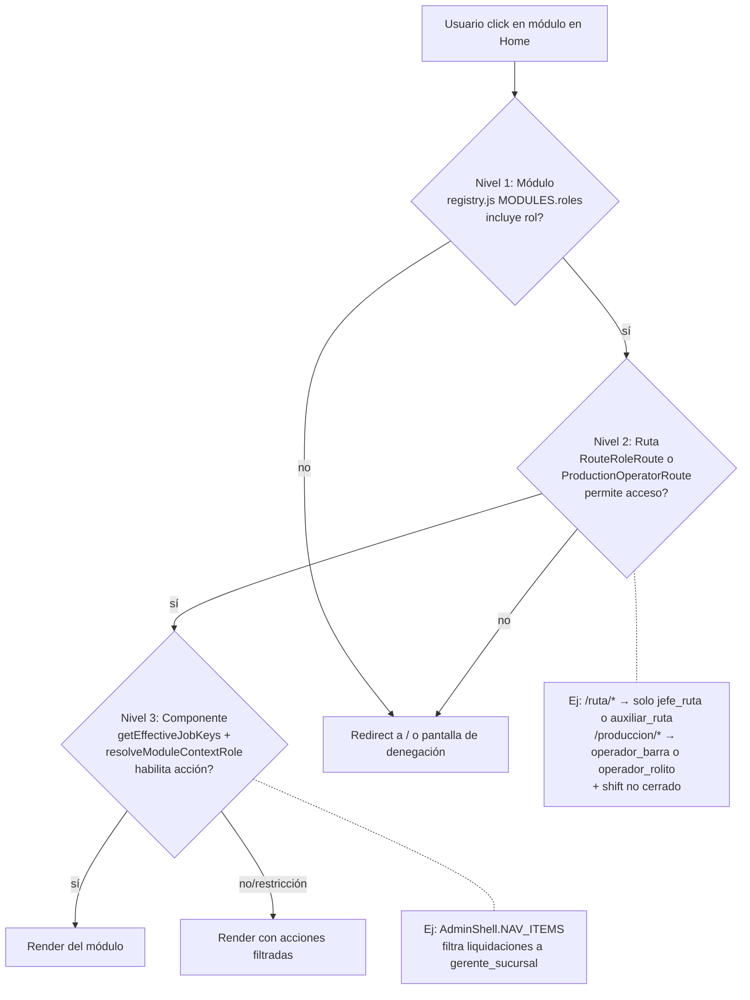

# CODE_MANUAL — PWA Colaboradores Grupo Frío

> Documento de ingeniería de referencia para el repositorio [`sebascm0906/colaboradores-pwa`](https://github.com/sebascm0906/colaboradores-pwa).
> Documenta el `as-is` al **2026-04-27** sobre el commit `52b7b5f`.
> Este manual es generado automáticamente y requiere review humano antes de considerarse fuente única de verdad.

---

## Tabla de contenidos

1. [Resumen ejecutivo](#1-resumen-ejecutivo)
2. [Estado actual del proyecto](#2-estado-actual-del-proyecto)
3. [Stack técnico](#3-stack-técnico)
4. [Arquitectura](#4-arquitectura)
5. [Estructura de carpetas](#5-estructura-de-carpetas)
6. [Modelos de datos y contratos](#6-modelos-de-datos-y-contratos)
7. [Endpoints API (referencia completa)](#7-endpoints-api-referencia-completa)
8. [Sistema de roles y permisos](#8-sistema-de-roles-y-permisos)
9. [Integraciones](#9-integraciones)
10. [Variables de entorno](#10-variables-de-entorno)
11. [Setup local](#11-setup-local)
12. [Despliegue](#12-despliegue)
13. [Convenciones del código](#13-convenciones-del-código)
14. [Decisiones arquitectónicas (ADRs)](#14-decisiones-arquitectónicas-adrs)
15. [Trampas conocidas y gotchas](#15-trampas-conocidas-y-gotchas)
16. [Roadmap técnico abierto](#16-roadmap-técnico-abierto)
17. [Glosario](#17-glosario)
18. [Changelog del manual](#18-changelog-del-manual)

---

## 1. Resumen ejecutivo

El PWA Colaboradores es una aplicación web instalable (PWA) construida en Vite + React 18 que sirve como interfaz operativa única para 11 roles operativos de sucursal de Grupo Frío (9 primarios + 2 secundarios). Reemplaza flujos antes hechos en Odoo backend, Excel, WhatsApp y procesos en papel.

**A quién sirve.** Once roles operativos:

**Roles primarios (9):**

1. Gerente
2. Auxiliar Admin
3. Operador Rolito
4. Operador Barra
5. Jefe de Producción
6. Almacenista PT
7. Almacenista Entregas
8. Jefes de Ruta
9. Supervisor de Ventas

**Roles secundarios (2) — cubren a los titulares cuando faltan:**

10. Auxiliar de Producción (cubre Operador Rolito y Operador Barra)
11. Auxiliar de Ruta (cubre Jefes de Ruta)

(El detalle por rol está en la sección [8](#8-sistema-de-roles-y-permisos). Existen 5 roles adicionales fuera del scope operativo de sucursal — corporativo, soporte, expansión — listados en la subsección [8.12](#812-roles-presentes-en-código-fuera-del-scope-operativo-de-sucursal).)

**Qué problema resuelve.** Captura digital end-to-end del ciclo operativo diario: turnos de producción, recepción y traspasos de producto terminado, despacho y conciliación de rutas, POS de mostrador, gastos, requisiciones, cierre de caja, alertas de gerente y supervisión comercial.

**Backends.** Llama directo a Odoo (`grupofrio.odoo.com`) vía controladores custom `/pwa-*` y JSON-RPC, y a n8n self-hosted (`n8n.grupofrio.mx`) para flujos auxiliares (voice intake, surveys, badges).

**Qué NO hace (alcance explícito).**

- No es un ERP. No reemplaza Odoo: lo consume.
- No gestiona RRHH (a pesar de lo que dice [README.md:1](../README.md), desactualizado). El portal RRHH/intranet es otro proyecto.
- No es B2C. El frontend público de KOLD para distribuidores es un repo separado.
- No corre lógica de negocio compleja en el cliente. Toda regla crítica (autorizaciones, validación de tenancy, posting de inventario) se valida en Odoo backend.
- No tiene rutas API server-side propias: es un SPA puro. Las rewrites de Vercel proxean a Odoo y n8n.

---

## 2. Estado actual del proyecto

Datos extraídos del inventario realizado el 2026-04-27. Las columnas **Validado E2E** y **Tests** salen de revisión de código y de la carpeta `tests/`. "Desconocido" significa que el código existe pero el flujo no se pudo ejercitar contra el backend desde esta auditoría.

| Módulo | Rol(es) | Pantallas | % completitud (frontend) | Validado E2E | Tests | Bloqueadores principales | Responsable |
|--------|---------|-----------|--------------------------|--------------|-------|--------------------------|-------------|
| `gerente` | Gerente | 5 propias + acceso a `admin` | 70%–80% | desconocido | no | Forecast unlock no validado E2E; KPIs degradan a mock | Sebastián (backend) |
| `admin` | Auxiliar Admin, Gerente, Dirección | 14 | 70%–79% | parcial | no | Liquidaciones desktop-only; cash-closing/authorize stub | Sebastián |
| `produccion` | Operador Rolito, Operador Barra, Auxiliar Producción (secundario) | 17 | 55%–65% | desconocido | parcial (8 unit tests) | PIN verification TODO en Rolito; legacy fallbacks `action_close_shift` | Sebastián |
| `supervision` | Jefe de Producción | 6 | 70%–80% | desconocido | parcial (3 unit tests) | Brine readings PoC voice; dashboards no validados runtime | Sebastián |
| `almacen-pt` | Almacenista PT | 12 | 75%–83% | parcial | parcial (5 unit tests) | G013 cerrado 2026-04-27; validación de inventario físico pendiente durante rollout de capacitación. Mitigación preventiva en G026 | Sebastián |
| `entregas` | Almacenista Entregas | 9 | 82%–90% | **parcial — QA PASS para load-execute (PR #25, Héctor + Manuel), return picking (PR #24), live-inventory producto 760 (PR #27)** | parcial (1 unit test) | Pallet reject sin log de responsable (G019). Merma positiva con stock libre real pendiente de QA explícito. | Sebastián |
| `ruta` | Jefe de Ruta, Auxiliar de Ruta (secundario) | 11 | 75%–85% | **parcial — `accept-load` validado en QA con carga por forecast 2026-04-26 (PR #25). Vehicle checklist backend validado e integrado en frontend (`/pwa-ruta/vehicle-checklist*`)** | no | Corte/liquidación persisten en localStorage (G016); tenancy split van + CEDIS resuelto en backend (no aplica al PWA) | Sebastián |
| `supervisor-ventas` | Supervisor de Ventas | 12 | 78%–93% | **parcial — forecast-create QA PASS con Aida 2026-04-27 (forecast id=18, state=`draft`, analytic_account_id=820, channel `van`). `forecast-confirm` no fue ejecutado en ese QA.** | no | Tareas y notas en `IS_STUB` (localStorage) (G006) | Sebastián |
| `torre` | Operador Torres (fuera de scope) | 2 | desconocido | desconocido | no | Validación requisiciones | Sebastián |
| `transformaciones` | Transversal | 1 + helpers | desconocido | desconocido | sí (helpers) | — | Sebastián |
| `screens/` (universales) | Todos | 6 (Login, Home, KPIs, Surveys, Badges, Profile) | 80% | parcial (login validado) | no | Metabase token stub; surveys/badges via n8n no validado | Sebastián |

> [!NOTE] Suposición: las columnas "% completitud" se basan en pantallas existentes vs. pantallas con `IS_STUB`/TODO/legacy fallback. **NO incluyen validación de flujo end-to-end** contra el backend en runtime. Por eso aparecen como rangos y se acompañan con "Validado E2E: desconocido" cuando aplica. Para una estimación más rigurosa se requiere ejercitar cada flujo en producción con datos reales.

---

## 3. Stack técnico

Versiones tomadas de [`package.json`](../package.json):

### Runtime y framework

| Paquete | Versión | Notas |
|---------|---------|-------|
| `react` | `^18.3.1` | Hooks, Suspense, lazy. Sin Server Components. |
| `react-dom` | `^18.3.1` | — |
| `react-router-dom` | `^6.26.2` | `BrowserRouter`, `lazy()` import por ruta. |
| `vite` | `^5.4.1` | Build, dev server, HMR. |
| `@vitejs/plugin-react` | `^4.3.1` | Fast Refresh. |
| `@tailwindcss/vite` | `^4.0.0` | Tailwind v4 (configuración via `@import "tailwindcss"` en CSS). |
| `tailwindcss` | `^4.0.0` | — |
| `vite-plugin-pwa` | `^0.20.5` | Workbox runtime, manifest generator. |
| `workbox-window` | `^7.1.0` | Registro de SW. |
| `xmlrpc` | `^1.3.2` | Listado en deps; **NO usado** en `src/` (la app usa fetch + JSON-RPC contra Odoo, no xml-rpc). Candidato a eliminación. |

### Tooling

| Paquete | Versión | Notas |
|---------|---------|-------|
| `eslint` | `^9.9.0` | Config flat en `eslint.config.js`. |
| `eslint-plugin-react`, `eslint-plugin-react-hooks`, `eslint-plugin-react-refresh` | varias | Plugin set estándar. |
| `@types/react`, `@types/react-dom` | `^18.3.x` | Tipos para JS+JSX (no TS). |

### Tests

`node:test` nativo (Node ≥ 18). Comando: `npm test` ejecuta `node --test tests/**/*.test.mjs`. **No usa Jest, Vitest, ni Playwright.** No hay tests E2E.

### Justificaciones de stack

- **Vite vs. Next.js.** El equipo eligió SPA puro porque toda la lógica server-side ya vive en Odoo. Next.js habría duplicado complejidad (rutas API, SSR) sin beneficio. Una rewrites de Vercel cubre el proxy a Odoo y n8n.
- **Zustand vs. Redux.** No usan ninguno. Estado global = `SessionContext` (React Context) en [`App.jsx:118`](../src/App.jsx) y `localStorage`. Para flujos transitorios, hooks locales por pantalla. Funciona porque la app es predominantemente formularios independientes; no hay un "modelo del mundo" complejo que requiera store global.
- **Serwist vs. Workbox.** `vite-plugin-pwa` usa Workbox debajo. Configuración en [`vite.config.js:15-44`](../vite.config.js) con `selfDestroying: true` durante v1 (el SW se desinstala solo en cada visita — desactivado el modo offline real).
- **Tailwind v4 con tokens centralizados.** Todos los estilos tipográficos, colores y radios viven en [`src/tokens.js`](../src/tokens.js) y se consumen como objetos, no como utility classes. No hay `style={{}}` inline en `src/`.

---

## 4. Arquitectura

### 4.1 Flujo de request del cliente



Notas operativas:

- El cliente **nunca** habla directo con Meta ni Deepgram. n8n actúa como API gateway con tokens server-side.
- Metabase se incrusta vía iframe usando un token JWT firmado por Odoo (endpoint `/pwa-metabase-token`, hoy stub — ver gap G001).
- En desarrollo, `vite.config.js` proxea las mismas tres rutas (`/api-n8n`, `/api-odoo`, `/odoo-api`) hacia los hosts reales, así el código no cambia entre dev y prod.

### 4.2 Módulos internos del PWA



### 4.3 Flujo de autenticación real

El sistema **NO usa JWT** para autenticar requests. Los tokens reales que valida el backend son opacos:

| Token | Tipo | TTL | Scope | Validación backend |
|-------|------|-----|-------|--------------------|
| `gf_employee_token` | opaco (`secrets.token_urlsafe(32)`) | 30 días sliding | Por empleado | Tabla en BD Odoo (`gf.employee.session` o equivalente) |
| `gf_salesops_token` | string estático | nunca expira | Global compartido entre todos los empleados | `ir.config_parameter` |
| `api_key` | opaco | sin expiración explícita | Por empleado | Tabla en BD Odoo |

El frontend almacena todos estos tokens en `localStorage.gf_session` junto con un campo llamado `session_token` que **NO es lo que autoriza** los requests — es un placeholder local con metadatos del empleado (envuelto en formato JWT-like, ver §4.4).



Cada request posterior añade headers desde la sesión local (ver [`src/lib/api.js:133-156`](../src/lib/api.js)):

| Header | Origen | Cuándo | Función real |
|--------|--------|--------|--------------|
| `X-GF-Employee-Token` | `session.gf_employee_token` | Siempre | **Fuente de verdad para autorización por empleado.** Backend valida contra BD y deriva el rol desde aquí. |
| `X-GF-Token` | `session.gf_salesops_token` o `VITE_GF_SALESOPS_TOKEN` | Solo paths `/gf/salesops/*` | Token compartido global. Por sí solo NO autoriza acciones con `required_role` — el rol se deriva del `X-GF-Employee-Token` (ver ADR-08). |
| `Api-Key` | `session.api_key` | Siempre, si existe | Compatibilidad con controllers Odoo legacy que la requieren. |
| `Authorization: Bearer <session_token>` | `session.session_token` | Siempre, si existe | Compatibilidad con clientes que esperan formato Bearer. **NO es el header que autoriza** los endpoints `/pwa-*` críticos. |

> [!NOTE] Lo que hay en `session_token` puede ser un string firmado por Odoo o un placeholder local construido por [`ScreenLogin.jsx:55-59`](../src/screens/ScreenLogin.jsx) (`buildLocalSessionToken`) en formato JWT-like. **Esto NO es un riesgo de seguridad por sí solo** porque el backend NO autoriza basándose en ese campo — autoriza con `X-GF-Employee-Token` validado contra BD. La preocupación inicial sobre "JWT alg:'none'" en G002 fue corregida durante la auditoría: el vector real era distinto (privilege escalation en `gf_saleops` via `employee_id` no verificado en payload), resuelto por Sebastián el 2026-05-05.

### 4.4 Matriz rol × módulo (11 operativos: 9 primarios + 2 secundarios)

Líneas continuas = rol primario; líneas punteadas = rol secundario que cubre al primario cuando falta.



### 4.5 Role-gating en 3 niveles



Implementación:

- **Nivel 1** — [`src/modules/registry.js`](../src/modules/registry.js): cada módulo declara `roles: ['*' | 'jefe_ruta' | ...]`. La home calcula `getModulesForRoles(getEffectiveJobKeys(session))` y solo renderiza esos.
- **Nivel 2** — [`src/App.jsx:148-226`](../src/App.jsx): `RouteRoleRoute` (gating de `/ruta/*`) y `ProductionOperatorRoute` (gating de `/produccion/*` con bloqueo si turno cerrado). Para los demás módulos `PrivateRoute` solo verifica sesión válida.
- **Nivel 3** — [`src/lib/roleContext.js:89-127`](../src/lib/roleContext.js): `getEffectiveJobKeys` combina `session.role` + `session.additional_job_keys`. `resolveModuleContextRole` resuelve qué rol activo usar dentro de un módulo multi-rol (`registro_produccion`, `admin_sucursal`).

> [!NOTE] La validación final de tenancy (que un Jefe de Ruta solo vea SU ruta) sucede server-side en Odoo. Confirmado por el comentario en [`src/App.jsx:144-147`](../src/App.jsx). Esta auditoría no validó el comportamiento real de Odoo.

---

## 5. Estructura de carpetas

```
colaboradores-pwa/
├── .ai-output/              # Salidas de scripts AI (no commit)
├── .claude/                 # Configuración Claude Code (NO modificar sin coordinar)
├── .diag-temp/              # Diagnósticos temporales (untracked, no commit)
├── .env.example             # Plantilla de variables (sin secretos reales)
├── .env.local               # Secretos locales (gitignored)
├── BACKEND_TODO.md          # Endpoints pendientes en backend Odoo (12 ítems vivos)
├── CHANGES.md               # Changelog del sprint de estabilización 2026-04-17
├── README.md                # ⚠️ Desactualizado: dice "Intranet/RRHH" (ver gap G009)
├── docs/                    # Documentación (este manual vive aquí)
│   ├── adr/                 # Architecture Decision Records (proyecto previo)
│   ├── superpowers/         # Guías internas operativas
│   ├── CODE_MANUAL.md       # Este documento
│   └── GAPS_BACKLOG.md      # Reporte priorizado de gaps
├── eslint.config.js         # Config flat de ESLint
├── index.html               # Entry HTML (Vite mounted point)
├── package.json             # Scripts: dev, build, preview, lint, test
├── public/                  # Assets estáticos (icons, manifest, logos)
├── scripts/                 # Scripts utilitarios (init_token.mjs, etc.)
├── src/                     # Código fuente — único sitio donde escribir lógica de app
│   ├── App.jsx              # Routing, SessionContext, ErrorBoundary, lazy imports
│   ├── main.jsx             # ReactDOM.createRoot mounting
│   ├── tokens.js            # Design tokens (colores, tipografía, radius, motion)
│   ├── index.css            # Reset + variables CSS + safe-area + scrollbar
│   ├── components/          # Componentes globales reusables (Toast, Loader, AuthBanner, PhotoCapture, ModuleRolePrompt, SessionErrorState)
│   ├── lib/                 # Helpers transversales (api.js, roleContext, sessionGuards, safeNumber, logout, effectiveRoles)
│   ├── modules/             # Un subdirectorio por área operativa
│   │   ├── admin/           # Módulo Auxiliar Admin / Gerente / Dirección General
│   │   ├── almacen-pt/      # Módulo Almacenista PT
│   │   ├── entregas/        # Módulo Almacenista Entregas
│   │   ├── gerente/         # Módulo Gerente
│   │   ├── produccion/      # Módulo Operador Rolito / Operador Barra / Auxiliar Producción
│   │   ├── ruta/            # Módulo Jefe de Ruta / Auxiliar de Ruta
│   │   ├── shared/          # Helpers compartidos entre módulos (handover, voice, packing coherence, machineService, etc.)
│   │   ├── supervision/     # Módulo Jefe de Producción
│   │   ├── supervisor-ventas/ # Módulo Supervisor de Ventas (legacy "/equipo")
│   │   ├── torre/           # Módulo Operador Torres (fuera de scope operativo)
│   │   ├── transformaciones/ # Componente compartido de transformación PT
│   │   └── registry.js      # Catálogo MODULES + helpers getModulesForRole
│   └── screens/             # Pantallas universales (Login, Home, KPIs, Surveys, Badges, Profile, ModuloPendiente)
├── tests/                   # Tests con node:test nativo (21 archivos *.test.mjs)
├── vercel.json              # Rewrites + headers + framework Vite
└── vite.config.js           # PWA, proxy dev, manualChunks
```

**Reglas de localización:**

- Lógica de un rol exclusivo → vive en `src/modules/<rol>/`. No introducir lógica de un rol en `src/screens/`.
- Helpers transversales → `src/lib/` (sin estado) o `src/modules/shared/` (con estado o dependencia de Odoo).
- Componentes UI compartidos por más de un módulo → `src/components/`.
- Estilos: usar tokens de [`src/tokens.js`](../src/tokens.js). Cero `style={{...}}` con valores literales (ya cumplido en todo `src/`).

---

## 6. Modelos de datos y contratos

El frontend NO usa TypeScript ni Zod. Los shapes están implícitos en cada caller. Documentamos los **5 modelos de datos centrales** que aparecen transversalmente.

### 6.1 Sesión (`gf_session` en localStorage)

```js
{
  source: 'odoo',
  session_token: '<header>.<payload>.odoo' | '<...>.bypass',
  role: 'gerente_sucursal' | 'auxiliar_admin' | 'operador_rolito' | 'operador_barra'
      | 'supervisor_produccion' | 'almacenista_pt' | 'almacenista_entregas'
      | 'jefe_ruta' | 'auxiliar_ruta' | 'supervisor_ventas'
      | 'direccion_general' | 'operador_torres' | 'director_ti' | 'auxiliar_ti' | 'jefe_legal',
  job_key: '<mismo que role>',
  additional_job_keys: ['<otros roles activos>'],
  module_role_contexts: { 'registro_produccion': 'operador_rolito', ... },
  job_title: 'Jefe de Líneas',
  employee_id: 690,
  user_id: 0,
  name: 'Arturo Narciso',
  company_id: 35,
  company: 'Fabricación de Congelados',
  warehouse_id: 49,
  plaza_id: 'IGUALA',  // derivado de warehouse_id en roleContext.js
  turno: 'M' | 'V' | 'N' | '',
  api_key: '<odoo api key>',
  odoo_api_key: '<idem>',
  odoo_employee_token: '<gf_employee_token>',
  gf_salesops_token: '<x_gf_token>',
  odoo_employee_session_id: <int> | null,
  odoo_employee_session_expires_at: '<iso>',
  employee_has_user: true | false,
  exp: <unix seconds, 7 días>,
  iat: <unix seconds>,
  _bypass: true   // SOLO en modo admin bypass
}
```

Validaciones cliente:

- `App.jsx:121-134` valida `exp` y purga sesión expirada al cargar.
- `App.jsx:331-355` detecta drift de sesión entre tabs y fuerza reload.
- `lib/sessionGuards.js` expone `requireWarehouse`, `requireCompany`, `requireEmployee` (lanzan `SessionIncompleteError`) y variantes `softWarehouse/softCompany/softEmployee` (devuelven null sin disparar logout).

### 6.2 Empleado (Odoo `hr.employee`)

Campos consumidos por el frontend (subset):

```js
{
  id: 690,
  name: 'Arturo Narciso',
  job_title: 'Jefe de Líneas',
  job_id: [<id>, '<label>'],          // many2one
  company_id: [35, 'Fabricación de Congelados'],
  warehouse_id: 49,                    // x_warehouse_id custom
  default_source_warehouse_id: 49,     // fallback
  pwa_job_key: 'supervisor_produccion', // primary
  job_key: '<idem>',                    // alias usado en algunas pantallas
  x_job_key: '<idem>',                  // alias legacy
  additional_job_keys: ['supervisor_ventas'],  // multirol
  additional_roles: ['<idem>'],                // alias legacy
  turno: 'M' | 'V' | 'N',
  x_turno: '<idem>',
  mobile_phone: '+52...',               // requerido por Magic Link (hoy comentado)
  image_128: '<base64>',                // perfil
}
```

`resolveRole(employee, jobTitle)` en [`ScreenLogin.jsx:109-134`](../src/screens/ScreenLogin.jsx) prioriza `pwa_job_key` directo y hace fallback a un `roleMap` por `job_title.toLowerCase().includes(needle)`.

### 6.3 Plaza ↔ Warehouse

`PLAZA_BY_WAREHOUSE` en [`src/lib/roleContext.js:11-26`](../src/lib/roleContext.js) deriva la plaza desde `warehouse_id`. Mapeo actual:

| Plaza | warehouse_ids |
|-------|---------------|
| IGUALA | 49, 50, 51, 52, 53, 54, 76, 89 |
| MORELIA | 2, 45, 46, 47, 48 |
| GUADALAJARA | 55, 56, 113 |
| TOLUCA | 57, 58, 59 |
| ZIHUATANEJO | 60, 61 |
| MANZANILLO | 62 |

> [!NOTE] Suposición: este mapeo es defensivo (Fase 0 voice PoC). Cuando Odoo añada `plaza_id` directo a la respuesta de `/api/employee-sign-in`, el cliente debería leerlo de ahí en lugar de derivarlo desde `warehouse_id`.

### 6.4 Compañías

| company_id | Nombre Odoo | Roles asociados |
|-----------|-------------|-----------------|
| 1 | CSC GF | Dirección General, Director TI, Auxiliar TI, Jefe Legal, Operador Torres |
| 34 | Soluciones en Producción GLACIEM (alias "GLACIEM") | Auxiliar Admin, Gerente Sucursal, Jefe Ruta, Auxiliar Ruta, Almacenista Entregas, Supervisor Ventas |
| 35 | Fabricación de Congelados | Operador Rolito, Operador Barra, Auxiliar Producción, Supervisor Producción, Almacenista PT |
| 36 | Vía Ágil | (declarado en `inferCompanyLabel`, sin roles primarios mapeados) |

Asignación: [`ScreenLogin.jsx:80-95` (`inferCompanyId`)](../src/screens/ScreenLogin.jsx).

### 6.5 Pedido (sale.order) en POS

Payload de creación (`createSaleOrder` en [`admin/api.js:35-37`](../src/modules/admin/api.js)):

```js
{
  partner_id: <int>,                  // res.partner cliente
  warehouse_id: <int>,
  payment_method: 'cash' | 'card' | 'transfer',
  payment_reference: '<folio terminal>',  // OBLIGATORIO si payment_method='card'
  order_lines: [
    { product_id: <int>, quantity: <number>, price_unit: <number> }
  ],
  notes: '<string opcional>',
  // umbrales: $5000 → banner gerente, $50000 → banner dirección
}
```

Endpoint Odoo: `POST /pwa-admin/sale-create`. **No existe `app/api/orders/route.ts`** — esta no es una app Next.js (gap G004 desmentido).

---

## 7. Endpoints API (referencia completa)

### 7.1 Tabla maestra

162+ endpoints únicos identificados en `src/`. Agrupados por familia con su backend, archivo caller principal y estado.

| Familia | Backend | Endpoints | Estado |
|---------|---------|-----------|--------|
| `/api/employee-sign-in` | Odoo directo (JSON-RPC) | 1 | live |
| `/pwa-employee-*` | Odoo directo | 4 (profile, phone, photo, logout) | live |
| `/pwa-metabase-token` | Odoo directo | 1 | **stub backend** (degrada a mock) |
| `/pwa-gerente/*` | Odoo directo | 4 | live |
| `/pwa-admin/*` | Odoo directo (algunos passthrough HTTP) | ~40 | live (algunos en BACKEND_TODO) |
| `/pwa-prod/*` | Odoo directo | ~25 | live (TODO action_close_shift legacy) |
| `/pwa-sup/*` | Odoo directo | ~17 | live |
| `/pwa-pt/*` | Odoo directo | ~25 | live |
| `/pwa-entregas/*` | Odoo directo | ~17 | live |
| `/pwa-ruta/*` | Odoo directo | ~13 | live (corte/liquidación localStorage gap) |
| `/pwa-supv/*` | Odoo directo | ~20 | live (tareas/notas IS_STUB localStorage) |
| `/pwa/evidence/upload` | Odoo directo | 1 | optional (no dispara logout en 401) |
| `/pwa-surveys`, `/pwa-badges` | n8n | 2 | live (no validado runtime) |
| `/gf/logistics/api/employee/*` | n8n legacy | ~5 | legacy (en proceso de migración a Odoo directo) |
| `/voice-intake`, `/voice-feedback` | n8n | 2 | live (PoC) |

### 7.2 Convenciones de routing

`src/lib/api.js` expone `api(method, path, body)` como helper único. La función:

1. Llama `routeDirect(method, path, body)` que intenta resolver el path con un handler directo Odoo (ej. `directAdmin`, `directProduccion`, etc.).
2. Si el handler retorna un valor que no sea el símbolo `NO_DIRECT`, lo devuelve.
3. Si retorna `NO_DIRECT`, hace `fetch(N8N_BASE + path, ...)` con headers de sesión y `Authorization: Bearer`.
4. Si la sesión está en modo bypass (`session._bypass === true`), bloquea el fallback a n8n y lanza error.

Endpoints "optional" (un 401 NO dispara `gf:session-expired`): `/pwa-metabase-token`, `/pwa-metabase/token`, `/pwa-admin/capabilities`, `/pwa/evidence/upload`. Lista en [`src/lib/api.js`](../src/lib/api.js) (símbolo interno).

Endpoints que **nunca caen a n8n** (decisión 2026-04-26/27, commits `2d39a11`, `b1ff64e`, `2a0f4cc`): toda la familia `/pwa-admin/*`, `/api/production/*`, `/pwa-admin/traspaso-mp/*`. Si Odoo devuelve error, se propaga al usuario en lugar de intentar n8n.

### 7.3 Auth y profile

#### `POST /api-odoo/employee-sign-in`

| Campo | Valor |
|-------|-------|
| Backend | Odoo (custom controller) |
| Método | POST JSON-RPC 2.0 |
| Roles autorizados | Cualquiera (es el endpoint de login) |
| Caller | [`ScreenLogin.jsx:9-49`](../src/screens/ScreenLogin.jsx) |
| Side effects | Marca `gf.employee.session` activa en Odoo |

Payload:
```json
{
  "jsonrpc": "2.0",
  "method": "call",
  "params": {
    "barcode": "<string>",
    "pin": "<string>",
    "app": "pwa_colaboradores",
    "app_ver": "<__APP_VERSION__>",
    "device_name": "<navigator.userAgent>"
  },
  "id": 1745764800000
}
```

Respuesta éxito:
```json
{
  "result": {
    "status": 200,
    "case": 1,
    "message": "Bienvenido, Arturo",
    "session_token": "<placeholder local con formato JWT-like, NO autoriza requests>",
    "api_key": "<base64>",
    "gf_employee_token": "<base64>",
    "gf_salesops_token": "<base64>",
    "gf_employee_session_id": 12345,
    "gf_employee_session_expires_at": "2026-05-04T...",
    "employee_has_user": true,
    "user_id": 706,
    "employee": { "id": 690, "name": "...", "job_title": "...", ... }
  }
}
```

Errores: `{result:{status: 401, error:"<msg>"}}`. Status HTTP 4xx/5xx también manejados.

#### `GET /pwa-employee-profile`, `PATCH /pwa-employee-phone`, `POST /pwa-employee-photo`, `POST /pwa-logout`

Lectura/edición de perfil. `pwa-logout` es fire-and-forget hacia `/gf/logistics/api/employee/sign_out`. Todos en [`ScreenProfile.jsx`](../src/screens/ScreenProfile.jsx).

#### `GET /pwa-metabase-token?job_key=<KEY>`

| Campo | Valor |
|-------|-------|
| Backend | Odoo (módulo `gf_metabase_embed`, **`installable: False` hoy**) |
| Estado | **Stub backend.** Frontend degrada a `MockMetabaseDashboard` en [`ScreenKPIs.jsx`](../src/screens/ScreenKPIs.jsx) si la respuesta es `{success:false}` o 401. |
| Caller | `ScreenKPIs.jsx:296` |
| Gap relacionado | G001 (P1) |

### 7.4 Familia `/pwa-admin/*`

Lista completa (≈40 endpoints) en [`src/modules/admin/api.js`](../src/modules/admin/api.js) y [`src/lib/api.js`](../src/lib/api.js). Los más críticos:

| Endpoint | Método | Roles autorizados | Side effects |
|----------|--------|-------------------|--------------|
| `/pwa-admin/sale-create` | POST | `auxiliar_admin`, `gerente_sucursal`, `direccion_general` | Crea `sale.order`, confirma, descuenta inventario al `dispatch-ticket` |
| `/pwa-admin/sale-cancel` | POST | `auxiliar_admin`, `gerente_sucursal` | Llama `sale.order.action_cancel`, revierte stock moves |
| `/pwa-admin/dispatch-ticket` | POST | Almacenista Entregas (operativamente), `auxiliar_admin` | Valida deliveries, descuenta stock |
| `/pwa-admin/cash-closing` | GET | `auxiliar_admin`, `gerente_sucursal`, `direccion_general` | Read-only |
| `/pwa-admin/cash-closing` | POST | `auxiliar_admin` (registra), `gerente_sucursal` (autoriza) | Crea `gf.cash.closing`. Umbrales hoy validados solo en UI. |
| `/pwa-admin/expense-create` | POST | `auxiliar_admin`, todos los roles operativos para sus gastos | Crea `hr.expense` con company + analítica |
| `/pwa-admin/expense-approve`, `/expense-reject` | POST | `gerente_sucursal`, `direccion_general` | Aprueba/rechaza |
| `/pwa-admin/requisition-create` | POST | `auxiliar_admin`, otros roles que las disparan | Crea `purchase.order` draft con analytic_distribution |
| `/pwa-admin/requisition-approve`, `/reject` | POST | `gerente_sucursal`, `direccion_general` | Cambia approval_state |
| `/pwa-admin/torre/*` | varios | `operador_torres` (revisión central de requisiciones) | Confirma/edita PO |
| `/pwa-admin/liquidaciones/*` | varios | `gerente_sucursal` (validación final) | Liquidación de jefes de ruta |
| `/pwa-admin/traspaso-mp/iguala-stock` | GET | `auxiliar_admin`, `gerente_sucursal` | Hardcoded para Fabricación-Iguala |

Ejemplo de payload (`createCashClosing` — [`admin/api.js:197-199`](../src/modules/admin/api.js)):

```json
{
  "company_id": 34,
  "warehouse_id": 89,
  "opening_fund": 5000,
  "denominations": [
    {"denomination": 500, "count": 12},
    {"denomination": 200, "count": 8}
  ],
  "other_income": 0,
  "other_expense": 0,
  "notes": "Sin novedad",
  "close": true
}
```

Reglas de autorización (validadas hoy solo cliente, gap G018 derivado):

- `|difference| > 100` → nota obligatoria mínimo 10 chars.
- `> 1000` → banner "requiere autorización gerente".
- `> 10000` → banner "requiere autorización dirección".

### 7.5 Familia `/pwa-prod/*` (Producción)

Lista en [`src/modules/produccion/api.js`](../src/modules/produccion/api.js). Los más críticos:

| Endpoint | Método | Roles | Side effects |
|----------|--------|-------|--------------|
| `/pwa-prod/my-shift` | GET | Operador Rolito/Barra/Aux | Lee `gf.production.shift` activo del empleado |
| `/pwa-prod/cycle-create` | POST | Operador Barra/Rolito | Crea `gf.production.cycle` con timing esperado calculado client-side |
| `/pwa-prod/packing-create` | POST | Operador Barra/Rolito | Crea `gf.production.packing` |
| `/pwa-prod/transformation-create` | POST | Producción + Almacén PT | Crea `gf.transformation.order` |
| `/pwa-prod/harvest` / `/harvest-with-pt-reception` | POST | Operador Barra | Crea `gf.production.harvest` y opcionalmente `gf.pt.reception` en una llamada |
| `/pwa-prod/shift-close` | POST | Operador Rolito/Barra | Cierra turno. **TODO legacy:** [`api.js:2895`](../src/lib/api.js) menciona migrar a `action_close` cuando esté en 100% de instancias |

### 7.6 Familia `/pwa-sup/*` (Supervisión Producción)

Endpoints ~17 en [`src/modules/supervision/api.js`](../src/modules/supervision/api.js). Cubre paros, descartes, energía, mantenimiento, lecturas de salmuera (PoC voice). Todos validan `warehouse_id` server-side.

### 7.7 Familia `/pwa-pt/*` (Almacén PT)

Endpoints ~25 en [`src/modules/almacen-pt/`](../src/modules/almacen-pt/) + [`entregas/api.js`](../src/modules/entregas/api.js) (compartidos). Los más críticos:

| Endpoint | Método | Side effects |
|----------|--------|--------------|
| `/pwa-pt/reception-create` | POST | Crea `stock.picking` IN. **Depende** de `gf.inventory.posting._action_done()` (modelo en `gf_production_ops`, no `gf_logistics_ops`) para postear inventario. **Estado funcional confirmado tras G013 cerrado el 2026-04-27.** Setup de nuevas plantas debe seguir `setup-plantas-produccion.md` (en repo backend de Odoo) para evitar la recurrencia descrita en G026. |
| `/pwa-pt/transfer-orchestrate` | POST | Orquesta `stock.picking` PT→Entregas |
| `/pwa-pt/shift-handover-create` / `accept` | POST | `gf.shift.handover` — relevo PT entre turnos |
| `/pwa-pt/eligible-receivers` | GET | `res.partner` filtrados por warehouse del receptor |

### 7.8 Familia `/pwa-entregas/*`

Endpoints ~17 en [`src/modules/entregas/api.js`](../src/modules/entregas/api.js) y handlers en [`src/lib/api.js:5500-5860`](../src/lib/api.js). Hub diario de Almacenista Entregas con flujo guiado de 7 pasos. Endpoints críticos validados en QA durante el ciclo de fixes operativos (PR #21–#27):

| Endpoint | Método | Side effects / Notas |
|----------|--------|----------------------|
| `/pwa-entregas/today-routes` | GET | Plan del día con stops y status. |
| `/pwa-entregas/load-execute` | POST | **PR #25.** Wrapper sobre `POST /gf/salesops/warehouse/load/execute` (envelope gf_saleops). Resuelve `picking_ids` desde `plan_id` automáticamente, mueve stock CEDIS → unidad. Backend resuelve `analytic_account_id` desde `warehouse_id`. Requiere `VITE_GF_SALESOPS_TOKEN` configurado en Vercel. NO sella el plan; el sello `load_sealed=true` lo hace el vendedor con `accept-load`. Idempotente: respuestas con `already_done:true` se traducen a `ok:true` con mensaje "ya estaba ejecutada". |
| `/pwa-entregas/confirm-load` | POST | Alias legacy de `load-execute` mantenido para no tocar UI. Mismo handler. |
| `/pwa-entregas/returns` | GET | **PR #24.** Lista líneas de retorno desde `gf.route.stop.line` (campos reales del modelo). Devuelve líneas + datos del stop. |
| `/pwa-entregas/return-accept` | POST | **PR #24.** Acepta líneas de devolución. Crea return picking sin auto-validación. Backend autoriza `almacenista_entregas` por `warehouse_id`. **QA PASS** con return picking creado. |
| `/pwa-entregas/scrap-create` | POST | **PR #23.** Merma defensiva: detecta respuesta `ok:false` con diagnóstico estructurado del backend (sin stock, productos no válidos, etc.) y NO muestra falso éxito. Implementación en [`ScreenMerma.jsx:130-145`](../src/modules/entregas/ScreenMerma.jsx). |
| `/pwa-entregas/live-inventory` | GET | **PR #27.** Stock vivo del CEDIS de Entregas. Devuelve `{items: [...], totals, generated_at}` con `on_hand_qty`, `reserved_qty`, `available_qty`. Regla: `available = quantity - reserved_quantity`. Domain: `child_of(lot_stock_id)`. **QA PASS** con producto 760 contra totales reales. Pantalla en [`ScreenInventarioEntregas.jsx`](../src/modules/entregas/ScreenInventarioEntregas.jsx). |
| `/pwa-entregas/shift-handover-*` | POST/GET | Relevo de turno entre almacenistas; bloqueo por shift ownership. |

### 7.9 Familia `/pwa-ruta/*` (Jefe de Ruta)

Endpoints ~13 en [`src/modules/ruta/api.js`](../src/modules/ruta/api.js). Server-side tenancy: cada endpoint valida que el `plan_id` pertenezca al empleado (mensaje "No tienes acceso a este plan" cuando no aplica — confirmado por comentario en [`App.jsx:144-147`](../src/App.jsx)).

| Endpoint | Notas |
|----------|-------|
| `/pwa-ruta/my-plan`, `/my-target`, `/my-load`, `/load-lines` | Carga del día. **PR #25:** `my-plan` filtra solo planes del día; `load-lines` devuelve la cantidad correcta. |
| `/pwa-ruta/accept-load` | Acepta carga del CEDIS y sella `load_sealed=true` en `gf.route.plan`. **QA PASS** con carga por forecast 2026-04-26 (PR #25). |
| `/pwa-ruta/validate-corte`, `/corte-confirm` | Corte de ruta. Hoy persistencia parcial en `localStorage` (gap G016 pendiente backend, BACKEND_TODO #3) |
| `/pwa-ruta/liquidation`, `/close-route` | Liquidación final |
| `/pwa-ruta/incident-create`, `/my-incidents`, `/team-incidents` | Incidencias en ruta |
| `/pwa-ruta/vehicle-checklist`, `/vehicle-checklist-create`, `/vehicle-checklist-init`, `/vehicle-checklist-complete` | Checklist de unidad pre-ruta. Backend validado, integrado en frontend en [`src/modules/ruta/api.js`](../src/modules/ruta/api.js). |

### 7.10 Familia `/pwa-supv/*` (Supervisor de Ventas)

Endpoints ~20 en [`src/modules/supervisor-ventas/api.js`](../src/modules/supervisor-ventas/api.js). Críticos:

| Endpoint | Estado |
|----------|--------|
| `/pwa-supv/team`, `/team-routes`, `/team-targets`, `/kpi-snapshots` | live |
| `/pwa-supv/forecast-create` | **PR #26 + commits `b968e43`, `46c262b`, `2dd0b08`.** Live. Resuelve `analytic_account_id` en cascada: (1) `body.analytic_account_id` override; (2) `body.sucursal` legacy; (3) `getSession().employee.x_analytic_account_id` desde JWT; (4) **fallback RPC** sobre `hr.employee.x_analytic_account_id` cuando JWT no lo trae todavía. Si falta en todos, lanza `ApiError` accionable con `code: 'missing_x_analytic_account_id'` y mensaje claro al usuario. Normaliza `channel` a lowercase (`'Van'` → `'van'`) antes de mandar al modelo. **QA PASS Aida 2026-04-27**: forecast id=18, state=`draft`, analytic_account_id=820, channel=`van`. Implementación en [`src/lib/api.js:6046-6145`](../src/lib/api.js). |
| `/pwa-supv/forecasts`, `/forecast-confirm`, `/forecast-cancel` | live (forecast-confirm no fue ejercitado en QA del 2026-04-27). |
| `/pwa-supv/tasks/*`, `/notes/*` | **Stub frontend** — `IS_STUB=true` en [`tareasService.js`](../src/modules/supervisor-ventas/tareasService.js) y [`notasService.js`](../src/modules/supervisor-ventas/notasService.js). Datos en localStorage. Gap G006 (P1). |
| `/pwa-supv/customers/inactive`, `/recovery` | live |

### 7.11 Endpoints n8n y voice

| Path | Workflow | Token |
|------|----------|-------|
| `/api-n8n/pwa-surveys`, `/pwa-badges` | n8n existente, no validado runtime | Bearer (Authorization) |
| `/voice-intake` (W120) | Deepgram → OpenAI → envelope | `VITE_N8N_VOICE_TOKEN` |
| `/voice-feedback` (W122) | Diff AI vs humano para QA | `VITE_N8N_VOICE_TOKEN` |
| `/pwa-auth-request`, `/pwa-auth-verify` | **COMENTADOS** en `ScreenLogin.jsx:189-245`. Magic Link conservado para reactivación. Bloqueado por `mobile_phone` faltante en 69/71 empleados. |

---

## 8. Sistema de roles y permisos

Los 11 roles operativos de sucursal son el scope oficial del sistema: **9 primarios** (titulares de cada función) + **2 secundarios** (auxiliares que cubren a los titulares cuando faltan, comparten módulos con su rol primario y necesitan documentación para operar). Cada subsección los documenta con: propósito, módulos visibles, rutas, endpoints, restricciones, mapeo Odoo, y estado de implementación.

> [!NOTE] Suposición sobre el "grupo Odoo (groups_id)": el código frontend NO conoce los `groups_id` de Odoo. La autorización efectiva ocurre server-side validando `pwa_job_key` del empleado contra reglas en cada controller `/pwa-*`. Por eso cada subsección lista `pwa_job_key` (string en `hr.employee`) en lugar del `groups_id` numérico. Verificar con Sebastián los `groups_id` reales en Odoo si hace falta el mapeo formal.

### 8.0 Estructura de los 11 roles operativos

| # | Tipo | job_key | Nombre operativo |
|---|------|---------|------------------|
| 1 | primario | `gerente_sucursal` | Gerente |
| 2 | primario | `auxiliar_admin` | Auxiliar Admin |
| 3 | primario | `operador_rolito` | Operador Rolito |
| 4 | primario | `operador_barra` | Operador Barra |
| 5 | primario | `supervisor_produccion` | Jefe de Producción |
| 6 | primario | `almacenista_pt` | Almacenista PT |
| 7 | primario | `almacenista_entregas` | Almacenista Entregas |
| 8 | primario | `jefe_ruta` | Jefe de Ruta |
| 9 | primario | `supervisor_ventas` | Supervisor de Ventas |
| 10 | secundario | `auxiliar_produccion` | Auxiliar de Producción (cubre Rolito y Barra) |
| 11 | secundario | `auxiliar_ruta` | Auxiliar de Ruta (cubre Jefe de Ruta) |

### 8.1 Gerente

| Atributo | Valor |
|----------|-------|
| `pwa_job_key` | `gerente_sucursal` |
| Empresa | 34 (GLACIEM) |
| Propósito | Vista ejecutiva de la sucursal: dashboard, alertas, gastos, forecast unlock, autorización en cierre y POS por encima de umbrales. |
| Módulos visibles | `gerente`, `admin_sucursal`, universales (KPIs, Surveys, Badges, Profile) |
| Rutas | `/gerente`, `/gerente/dashboard`, `/gerente/alertas`, `/gerente/gastos`, `/gerente/forecast`, todo `/admin/*` |
| Pantallas propias (5) | `ScreenGerente`, `ScreenDashboardGerente`, `ScreenAlertasGerente`, `ScreenForecastUnlock`, `ScreenGastos` (gerente) |
| Pantallas heredadas | 14 de `admin/` |
| Endpoints | `/pwa-gerente/alerts`, `/pwa-gerente/kpi-summary`, `/pwa-gerente/forecasts-locked`, `/pwa-gerente/forecast-unlock`, todos los `/pwa-admin/*` con permisos elevados |
| Restricciones | En `AdminShell.NAV_ITEMS` solo `gerente_sucursal` ve Liquidaciones, Materia Prima y Validar Materiales (segregación de funciones — CHANGES.md Fase 3) |
| Estado | 70%–80% completitud frontend |
| Validado E2E | desconocido |
| Tests | no |

### 8.2 Auxiliar Admin

| Atributo | Valor |
|----------|-------|
| `pwa_job_key` | `auxiliar_admin` |
| Empresa | 34 (GLACIEM) |
| Propósito | Operación administrativa diaria de sucursal: POS mostrador, registro de gastos, requisiciones de compra, traspasos de materia prima, validación de bolsas. |
| Módulos visibles | `admin_sucursal`, universales |
| Rutas | `/admin`, `/admin/pos`, `/admin/ticket/:orderId`, `/admin/gastos`, `/admin/gastos-historial`, `/admin/gastos/aprobar`, `/admin/requisiciones`, `/admin/liquidaciones`, `/admin/materia-prima`, `/admin/traspaso-materia-prima`, `/admin/bolsas/validar`, `/admin/cierre`, `/admin/materiales/validar`, `/admin/materiales/resolver-rechazo` |
| Pantallas propias (14) | `ScreenAdminPanel`, `ScreenPOS`, `ScreenTicket`, `ScreenGastos`, `ScreenGastosHistorial`, `ScreenGastosAprobar`, `ScreenRequisiciones`, `ScreenLiquidaciones`, `ScreenMateriaPrima`, `ScreenTraspasoMateriaPrima`, `ScreenValidacionBolsas`, `ScreenCierreCaja`, `ScreenMaterialesValidate`, `ScreenMaterialesResolverRejected` |
| Endpoints clave | `/pwa-admin/pos-products`, `/sale-create`, `/cash-closing`, `/expense-create`, `/requisition-create` |
| Restricciones | NO ve Liquidaciones, Materia Prima ni Validar Materiales (esos son del gerente). NO aprueba gastos (eso es gerente/dirección). |
| Estado | 70%–79% completitud frontend |
| Validado E2E | parcial (POS validado, cierre con umbrales validado UI) |
| Tests | no |

### 8.3 Operador Rolito

| Atributo | Valor |
|----------|-------|
| `pwa_job_key` | `operador_rolito` |
| Empresa | 35 (Fabricación de Congelados) |
| Propósito | Operar la línea Rolito: ciclos de producción, empaque, reportar incidencias, entregar turno con declaración de bolsas. |
| Módulos visibles | `registro_produccion`, universales |
| Rutas | `/produccion`, `/produccion/checklist`, `/produccion/ciclo`, `/produccion/empaque`, `/produccion/corte`, `/produccion/transformacion`, `/produccion/incidencia`, `/produccion/cierre`, `/produccion/declaracion-bolsas`, `/produccion/handover`, `/produccion/turno-entregado`, `/produccion/reconciliacion` |
| Pantallas operativas exclusivas (≈6) | `ScreenTurnoRolito`, `ScreenCicloRolito`, `ScreenEmpaqueRolito`, `ScreenIncidenciaRolito`, `ScreenCierreRolito`, `ScreenHandoverTurno` |
| Endpoints clave | `/pwa-prod/my-shift`, `/cycle-create`, `/packing-create`, `/incident-create`, `/shift-close` |
| Restricciones | `ProductionOperatorRoute` en `App.jsx:159` valida rol y bloquea si turno cerrado (redirige a `/produccion/turno-entregado`). PIN verification TODO ([`SYSTEM_MAP.js:92`](../src/modules/shared/SYSTEM_MAP.js)) — gap G012. |
| Estado | 55%–65% completitud frontend |
| Validado E2E | desconocido |
| Tests | parcial (cycleTiming.test.mjs, checklistContext.test.mjs, miTurnoActions.test.mjs cubren helpers) |

### 8.4 Operador Barra

| Atributo | Valor |
|----------|-------|
| `pwa_job_key` | `operador_barra` |
| Empresa | 35 (Fab Congelados) |
| Propósito | Operar la línea Barras: ciclos de evaporador, lecturas de tanques de salmuera, harvest+recepción PT en una sola transacción, paros e incidencias. |
| Módulos visibles | `registro_produccion`, universales |
| Rutas | mismas de Rolito + `/produccion/tanque`, `/produccion/tanque/:machineId` |
| Pantallas exclusivas (≈8) | `ScreenMiTurno` (legacy V1 que para Barra sigue siendo el principal), `ScreenChecklist`, `ScreenCiclo`, `ScreenEmpaque`, `ScreenCorte`, `ScreenTransformacion`, `ScreenTanqueLista`, `ScreenTanque` |
| Endpoints clave | `/pwa-prod/harvest-with-pt-reception`, `/pwa-prod/tank-incident`, `/pwa-prod/machine-salt`, `/pwa-prod/cycles` |
| Restricciones | mismas de Rolito |
| Estado | 55%–65% completitud frontend |
| Validado E2E | desconocido |
| Tests | parcial (barraHarvestReception.test.mjs, brineReadings.test.mjs) |

### 8.5 Jefe de Producción

| Atributo | Valor |
|----------|-------|
| `pwa_job_key` | `supervisor_produccion` |
| Empresa | 35 (Fab Congelados) |
| Propósito | Supervisar la planta turno a turno: dashboard de paros y descartes, energía, mantenimiento, control de turno (apertura/cierre), validación de PIN para cerrar turnos de operadores. |
| Módulos visibles | `supervision_produccion`, universales |
| Rutas | `/supervision`, `/supervision/paros`, `/supervision/merma`, `/supervision/energia`, `/supervision/mantenimiento`, `/supervision/turno` |
| Pantallas (6) | `ScreenSupervision`, `ScreenParos`, `ScreenMerma`, `ScreenEnergia`, `ScreenMantenimiento`, `ScreenControlTurno` + modal `BrineReadingModal` |
| Endpoints clave | `/pwa-sup/dashboard`, `/operators`, `/active-shift`, `/shift-create`, `/shift-start`, `/shift-close-check`, `/shift-close`, `/downtime-*`, `/scrap-*`, `/energy-*`, `/maintenance-*`, `/brine-reading-create` |
| Restricciones | `resolveSupervisionWarehouseId` valida warehouse_id desde sesión; readiness backend-first con `BLOCKER_ROUTE` que mapea códigos a pantallas correctivas |
| Estado | 70%–80% completitud frontend |
| Validado E2E | desconocido |
| Tests | parcial (supervisionShiftContext.test.mjs, shiftStartReadiness.test.mjs) |

### 8.6 Almacenista PT

| Atributo | Valor |
|----------|-------|
| `pwa_job_key` | `almacenista_pt` |
| Empresa | 35 (Fab Congelados) |
| Propósito | Custodia de producto terminado: recibir desde producción, transferir a Entregas/CEDIS, transformaciones de empaque, materiales, declaración de bolsas, relevo de turno PT. |
| Módulos visibles | `almacen_pt`, universales |
| Rutas | `/almacen-pt`, `/almacen-pt/recepcion`, `/inventario`, `/transformacion`, `/traspaso`, `/handover`, `/merma`, `/materiales`, `/materiales/crear`, `/declaracion-bolsas`, `/materiales/report/:issueId`, `/materiales/reconciliar` |
| Pantallas (12) | `ScreenAlmacenPT` + 11 más |
| Endpoints clave | `/pwa-pt/reception-create`, `/transfer-orchestrate`, `/shift-handover-*`, `/scrap-*`, `/inventory`, `/eligible-receivers` |
| Restricciones | `getPtShiftStatus` redirige automáticamente a `/almacen-pt/handover` si hay handover_pending |
| Estado | 75%–83% completitud frontend |
| Validado E2E | parcial |
| Tests | parcial (materialsNavigation, materialDispatchConfig, ptHandoverState, bagCustodyService, requisitionReceiptState) |
| Bloqueador propio | Estado funcional confirmado tras remediación de G013 (2026-04-27). Las 4 sub-causas de configuración corregidas en plaza Iguala. Inventario PT en proceso de validación contra físico durante rollout de capacitación. Ver G013 (resuelto) y G026 (mitigación preventiva con `setup-plantas-produccion.md` en repo backend de Odoo modules). |

### 8.7 Almacenista Entregas

| Atributo | Valor |
|----------|-------|
| `pwa_job_key` | `almacenista_entregas` |
| Empresa | 34 (GLACIEM) |
| Propósito | Operación CEDIS de logística: recibir PT, cargar unidades, ejecutar operación del día, devoluciones, merma, cierre de turno con timeline guiado de 7 pasos. |
| Módulos visibles | `almacen_entregas`, universales |
| Rutas | `/entregas`, `/entregas/recibir-pt`, `/transformacion`, `/carga`, `/operacion`, `/devoluciones`, `/merma`, `/cierre-turno`, `/inventario` |
| Pantallas (9) | `ScreenHubDia`, `ScreenRecibirPT`, `ScreenCargaUnidades`, `ScreenOperacionDia`, `ScreenDevolucionesV2`, `ScreenMerma`, `ScreenCierreTurno`, `ScreenTransformacionEntregas`, `ScreenInventarioEntregas` |
| Endpoints clave | `/pwa-entregas/today-routes`, `/returns`, `/return-accept`, `/scrap-create`, `/shift-handover-*`, `/live-inventory`, `/load-execute`, `/confirm-load` (alias legacy) |
| Restricciones | `computeStepStatuses` bloquea cada paso hasta que el anterior esté completo; ownership check server-side; backend autoriza `almacenista_entregas` por `warehouse_id` en devoluciones (PR #24). |
| Estado | 82%–90% completitud frontend |
| Validado E2E | **parcial — QA PASS** para load-execute (PR #25, Héctor + Manuel), return picking (PR #24), live-inventory producto 760 (PR #27). Merma defensiva (PR #23) detecta `ok:false` y diagnóstico estructurado. |
| Tests | parcial (1: entregasShiftHandover.test.mjs) |
| Fixes recientes | PR #21 (cambio de turno + mostrador defensivo), PR #22 (defensa contra falso éxito en devoluciones legacy), PR #23 (defensa contra falso éxito en merma), PR #24 (BFF de devoluciones con `gf.route.stop.line` real), PR #25 (load-execute + filtros ruta + ConfirmDialog open), PR #27 (live-inventory desempaca con `pickListResponse`). |

### 8.8 Jefe de Ruta

| Atributo | Valor |
|----------|-------|
| `pwa_job_key` | `jefe_ruta` (también `auxiliar_ruta` puede entrar al módulo) |
| Empresa | 34 (GLACIEM) |
| Propósito | Vendedor de UNA ruta (no supervisor multi-ruta — para multi-ruta usar Supervisor Ventas). 6 estaciones guiadas: checklist unidad → aceptar carga → control ruta → inventario → corte → liquidación → cierre. |
| Módulos visibles | `cierre_ruta`, universales |
| Rutas | `/ruta`, `/ruta/checklist`, `/carga`, `/incidencias`, `/kpis`, `/conciliacion`, `/control`, `/inventario`, `/corte`, `/liquidacion`, `/cierre` |
| Pantallas (11) | `ScreenMiRutaV2` + 10 más |
| Endpoints clave | `/pwa-ruta/my-plan`, `/my-target`, `/my-load`, `/load-lines`, `/accept-load`, `/validate-corte`, `/incident-create`, `/liquidation`, `/close-route`, `/team-incidents`, `/vehicle-checklist*` |
| Restricciones | `RouteRoleRoute` (`App.jsx:150`): solo `jefe_ruta` y `auxiliar_ruta`; otros redirigidos a home. Server-side tenancy: "No tienes acceso a este plan" si no es dueño. Backend resolvió tenancy split van + CEDIS para `accept-load` (fix backend, no aplica al PWA). |
| Estado | 75%–85% completitud frontend |
| Validado E2E | **parcial — `accept-load` validado en QA con carga por forecast 2026-04-26 (PR #25). Vehicle checklist backend validado e integrado en frontend.** |
| Tests | no |
| Riesgos abiertos | Corte y liquidación persisten en `localStorage` ([`routeControlService.js:332-407`](../src/modules/ruta/routeControlService.js)). Si el vendedor cierra la app antes del cierre final, pierde estado. BACKEND_TODO #3 (gap G016). |
| Fixes recientes | PR #25 (`/pwa-entregas/load-execute` + `accept-load` valida con carga por forecast + `my-plan` filtra hoy + `load-lines` cantidad correcta + `ConfirmDialog open`). |

### 8.9 Supervisor de Ventas

| Atributo | Valor |
|----------|-------|
| `pwa_job_key` | `supervisor_ventas` |
| Empresa | 34 (GLACIEM) |
| Propósito | Centro de control comercial de la sucursal: control hoy/ayer, dashboard, pronóstico, metas vendedores, tareas, notas a clientes, recuperación de clientes inactivos, score semanal. |
| Módulos visibles | `supervisor_ventas`, universales |
| Rutas | `/equipo`, `/equipo/vendedor/:vendedorId`, `/sin-visitar`, `/score-semanal`, `/cierre`, `/dashboard`, `/pronostico`, `/metas`, `/tareas`, `/notas`, `/recuperacion`, `/nota-rapida` |
| Pantallas (12) | `ScreenControlComercial`, `ScreenDashboardVentas`, `ScreenPronostico`, `ScreenMetasVendedores`, `ScreenTareasSupervisor`, `ScreenNotasCliente`, `ScreenClientesRecuperacion`, `ScreenDetalleVendedor`, `ScreenClientesSinVisitar`, `ScreenScoreSemanal`, `ScreenCierreOperativo`, `ScreenNotaRapida` |
| Endpoints clave | `/pwa-supv/team`, `/team-routes`, `/forecast-*`, `/team-targets`, `/kpi-snapshots`, `/tasks/*`, `/notes/*`, `/customers/*` |
| Restricciones | Sin role-gating de ruta específico (solo PrivateRoute). |
| Estado | 78%–93% completitud frontend |
| Validado E2E | **parcial — forecast-create QA PASS con Aida 2026-04-27**: forecast id=18, state=`draft`, analytic_account_id=820, channel=`van`. `forecast-confirm` no fue ejecutado en ese QA. |
| Tests | no |
| Riesgos abiertos | Tareas y notas en `IS_STUB` (localStorage). Banner visible "modo temporal". Datos no sincronizan entre dispositivos. Gap G006. |
| Fixes recientes | PR #26 + commits `b968e43`, `46c262b`, `2dd0b08`. `forecast-create` ahora resuelve `analytic_account_id` en cascada (body → JWT → RPC fallback `hr.employee.x_analytic_account_id`); normaliza `channel` a lowercase; lanza `ApiError` accionable cuando RRHH no tiene `x_analytic_account_id` poblado. |

### 8.10 Auxiliar de Producción (rol secundario)

| Atributo | Valor |
|----------|-------|
| `pwa_job_key` | `auxiliar_produccion` |
| Tipo | Secundario — cubre a Operador Rolito y Operador Barra |
| Empresa | 35 (Fab Congelados) |
| Propósito | Cubrir al titular Rolito o Barra cuando falta. No es un rol independiente: usa exactamente las mismas pantallas y endpoints que el primario al que cubra. |
| Módulos visibles | `registro_produccion` (mismo que Rolito/Barra), universales |
| Rutas | Las mismas que Operador Rolito y Operador Barra (todas bajo `/produccion/*`) |
| Pantallas | Comparte las 17 pantallas del módulo `produccion/`. **No tiene pantallas exclusivas.** |
| Endpoints | Los mismos `/pwa-prod/*` que los primarios |
| ¿El sistema diferencia primario vs secundario? | **Parcialmente.** En `MODULE_ROLE_VARIANTS['registro_produccion']` (en [`src/lib/roleContext.js:2`](../src/lib/roleContext.js)) los tres roles están listados juntos: `['operador_barra', 'operador_rolito', 'auxiliar_produccion']`. El `ProductionOperatorRoute` en [`App.jsx:184`](../src/App.jsx) **solo valida `operador_barra` y `operador_rolito`**, no `auxiliar_produccion` directamente. En la práctica el auxiliar entra al módulo si tiene `additional_job_keys` con barra/rolito. |
| Mapeo `inferCompanyId` | [`ScreenLogin.jsx:82-84`](../src/screens/ScreenLogin.jsx) — incluye `auxiliar_produccion` explícitamente para asignar company 35 |
| Bypass admin | Listado en `ADMIN_EMPLOYEES` con id 691 ("Julio Raul de la Cruz González") |
| Estado | 55%–65% completitud frontend (idéntico al primario que cubra) |
| Validado E2E | desconocido |
| Tests | parcial (los mismos del primario: cycleTiming, checklistContext, miTurnoActions, brineReadings) |
| Bloqueador propio | `ProductionOperatorRoute` no contempla `auxiliar_produccion` por sí solo. Si el empleado tiene SOLO ese job_key, el route gate puede bloquearlo. Verificar comportamiento real (gap candidato si falla). |

### 8.11 Auxiliar de Ruta (rol secundario)

| Atributo | Valor |
|----------|-------|
| `pwa_job_key` | `auxiliar_ruta` |
| Tipo | Secundario — cubre a Jefe de Ruta |
| Empresa | 34 (GLACIEM) |
| Propósito | Cubrir al titular Jefe de Ruta cuando falta. Comparte el flujo guiado de 6 estaciones del módulo. |
| Módulos visibles | `cierre_ruta`, universales |
| Rutas | Las mismas que Jefe de Ruta — todas bajo `/ruta/*` |
| Pantallas | Comparte las 11 pantallas del módulo `ruta/`. **No tiene pantallas exclusivas.** |
| Endpoints | Los mismos `/pwa-ruta/*` que el primario |
| ¿El sistema diferencia primario vs secundario? | **Sí, en route gating.** `RUTA_ALLOWED_ROLES` en [`App.jsx:148`](../src/App.jsx) incluye explícitamente `['jefe_ruta', 'auxiliar_ruta']`. Ambos pueden entrar a `/ruta/*`. La validación de tenancy server-side seguirá restringiendo a los planes del empleado loggeado. |
| Mapeo `inferCompanyId` | [`ScreenLogin.jsx:85-87`](../src/screens/ScreenLogin.jsx) — incluye `auxiliar_ruta` explícitamente para asignar company 34 |
| Bypass admin | Listado en `ADMIN_EXTRA_ROLES` ("Auxiliar de Ruta — sin empleado asignado") en [`ScreenLogin.jsx:344-345`](../src/screens/ScreenLogin.jsx). No hay aún un empleado real con este job_key. |
| Estado | 70%–82% completitud frontend (idéntico al primario que cubra) |
| Validado E2E | desconocido |
| Tests | no |
| Bloqueador propio | No hay empleado real con `auxiliar_ruta` en producción al 2026-04-02 (auditoría de bypass admin). Si se asigna, validar que el flujo de tenancy (Jefe de Ruta vs su auxiliar) funciona correctamente — no es trivial: ¿el auxiliar ve solo sus propios planes, o también los del titular al que cubre? |

### 8.12 Roles presentes en código fuera del scope operativo de sucursal

5 roles adicionales aparecen en el código pero no son operativos de sucursal. Se documentan como referencia, sin auditoría en profundidad.

| job_key | Categoría tentativa | Pantallas | Endpoints específicos | Recomendación |
|---------|---------------------|-----------|------------------------|---------------|
| `direccion_general` | Corporativo | Hereda de `admin_sucursal` (acceso elevado) | `/pwa-admin/*` con permisos máximos (aprobaciones de director) | Documentar; escalar a Yamil si requiere módulo dedicado. |
| `operador_torres` | Soporte central (CSC GF) | 2 propias (`ScreenTorreRequisiciones`, `ScreenTorreDetail`) | `/pwa-admin/torre/*` | Documentar; expansión planeada (no en los 11). |
| `director_ti` | Soporte / corporativo | Sin módulo asignado en `registry.js` | — | Limpiar si no se usa, o escalar a Yamil. |
| `auxiliar_ti` | Soporte | Sin módulo asignado | — | Idem. |
| `jefe_legal` | Corporativo | Sin módulo asignado | — | Idem. |

> [!NOTE] El bypass de admin en [`ScreenLogin.jsx:316-339`](../src/screens/ScreenLogin.jsx) lista 18 empleados reales por nombre+ID con sus roles asignados. Esos IDs son fuente de verdad para el sandbox de testing. NO usar en producción real.

---

## 9. Integraciones

### 9.1 Odoo

| Atributo | Valor |
|----------|-------|
| URL | `https://grupofrio.odoo.com` |
| Variable | `VITE_ODOO_URL` |
| Auth | PIN + barcode → `/api/employee-sign-in` (JSON-RPC 2.0) |
| Tokens en cliente | `api_key` (header `Api-Key`), `gf_employee_token` (`X-GF-Employee-Token`), `gf_salesops_token` (`X-GF-Token` solo para `/gf/salesops/*`), `session_token` (`Authorization: Bearer`) |
| Variable de password | NO existe en frontend. `ODOO_PASSWORD` es solo backend (no aparece en este repo). `ODOO_PASS` (prohibida) **no existe**. |
| Modelos accedidos | `hr.employee`, `gf.cash.closing`, `gf.production.shift|cycle|packing|harvest|tank|brine_reading|downtime|scrap|maintenance|energy|machine|line`, `gf.route.plan|target|load|delivery|return|incident|stop|liquidation`, `gf.saleops.forecast|kpi.snapshot`, `gf.shift.handover`, `gf.transformation.order`, `gf.pwa.requisition`, `gf.ops.event_log`, `gf.inventory.posting`, `gf.task.task`, `gf.note.note`, `gf.supv.note`, `gf.pallet`, `gf.pt.reception`, `sale.order`, `purchase.order`, `purchase.order.line`, `stock.warehouse|quant|picking|move|location|scrap|transfer`, `res.partner`, `account.analytic.account`, `ir.attachment`, `ir.config_parameter`, `ir.model.fields`. |
| Métodos | JSON-RPC `web/dataset/call_kw` con `read`, `search_read`, `create`, `write`, `unlink`. Wrappers en [`src/lib/api.js`](../src/lib/api.js): `readModel`, `readModelSorted`, `createUpdate`, `odooJson`, `odooHttp`. |
| Warehouse context | Extraído del empleado al login (`hr.employee.warehouse_id` o `default_source_warehouse_id`). Pasado explícitamente como query param o en context a queries de inventario, cash-closing, materia prima, today-sales, today-expenses. |

> [!IMPORTANT] **Setup de nuevas plantas de producción.** Cualquier expansión a nuevas plantas (León, etc.) debe seguir el procedimiento documentado en `setup-plantas-produccion.md` (en el repo backend de Odoo modules de Sebastián). Ese documento incluye tabla de `production_location_id` por empresa, configuración de `mp_turno_location_id`, asignación de turnos a líneas, empresa por planta, y el incidente de Iguala 2026-04-27 como caso de estudio. **Saltarse este procedimiento reproduce el bug raíz de G013** (4 sub-causas de configuración que dejaron 56% de las recepciones PT en error en plaza Iguala). Ver también gap G026 con la mejora futura sugerida (validador en modelo `gf.production.line`).

### 9.2 n8n

| Atributo | Valor |
|----------|-------|
| URL | `https://n8n.grupofrio.mx/webhook` (self-hosted, **no** `car12los023.app.n8n.cloud`, **no** `yamilestebanh.app.n8n.cloud`) |
| Variable | `VITE_N8N_WEBHOOK_URL` |
| Workflows consumidos | `voice-intake` (W120), `voice-feedback` (W122), `pwa-surveys`, `pwa-badges` |
| Bearer | `VITE_N8N_VOICE_TOKEN` (frontend) — gap G003 |
| Patrones de uso | El frontend usa n8n SOLO como fallback si Odoo no resuelve el endpoint. Decisiones recientes (2026-04-26/27) sacaron `/pwa-admin/*`, `/api/production/*` y `/pwa-admin/traspaso-mp/*` del fallback: ahora SIEMPRE van directo a Odoo. |
| Magic Link legacy | `/pwa-auth-request`, `/pwa-auth-verify` están comentados en [`ScreenLogin.jsx:189-245`](../src/screens/ScreenLogin.jsx). Bloqueador de datos: 69/71 empleados sin `mobile_phone`. |

### 9.3 Magic Link (auth alternativo)

Estado: **comentado en frontend** desde antes del último commit. Conservado para reactivación. Bloqueador real es de datos en Odoo, no de código.

Para reactivar, según comentarios y BACKEND_TODO:

1. Cargar `mobile_phone` válido en `hr.employee` para los 69 empleados pendientes (auditoría 2026-04-02 reportó 69/71 sin teléfono).
2. Descomentar `requestMagicLink` y `verifyMagicToken` en [`ScreenLogin.jsx:189-245`](../src/screens/ScreenLogin.jsx).
3. Verificar que los workflows n8n `pwa-auth-request` y `pwa-auth-verify` siguen vivos.
4. Validar que `phone` se valida server-side contra el empleado loggeado (NO aceptar phone arbitrario como input).

### 9.4 WhatsApp / Meta

| Atributo | Valor |
|----------|-------|
| Uso desde frontend | **Ninguno.** El frontend NO llama a WhatsApp Cloud API. |
| Uso desde n8n | Sí — n8n usa `WA_ACCESS_TOKEN_OPERACIONES` server-side para enviar OTP/notificaciones operativas. |
| Variables | `VITE_WA_PHONE_ID_OPERACIONES` (cliente, referencia visible), `WA_ACCESS_TOKEN_OPERACIONES` (server-side, vive en `/opt/kold-n8n/.env` de n8n self-hosted, NO en Vercel) |
| Variables prohibidas | `META_ACCESS_TOKEN`, `WA_PHONE_NUMBER_ID` — **no existen** en este repo (verificado por grep). Cumple. |

### 9.5 Metabase

| Atributo | Valor |
|----------|-------|
| URL | `https://bi.grupofrio.mx` |
| Variable | `VITE_METABASE_URL` |
| Integración | Iframe embed con token JWT firmado por Odoo (módulo `gf_metabase_embed`). |
| Estado backend | **STUB** (`installable: False`). |
| Comportamiento frontend | [`ScreenKPIs.jsx:296`](../src/screens/ScreenKPIs.jsx) llama `/pwa-metabase-token`; si la respuesta es `{success:false}` o 401 (endpoint marcado como "optional" en `lib/api.js`), degrada a `MockMetabaseDashboard` sin disparar logout. Parche del 2026-04-18. |
| Gap | G001 (P1) |

### 9.6 Voice-to-Form (PoC Fase 0)

| Atributo | Valor |
|----------|-------|
| Workflows n8n | W120 (`voice-intake`): MediaRecorder → Deepgram STT → OpenAI parser → envelope normalizado. W122 (`voice-feedback`): diff humano vs AI. |
| Componente | [`src/modules/shared/voice/VoiceInputButton.jsx`](../src/modules/shared/voice/VoiceInputButton.jsx) |
| Helpers | [`voiceMatchers.js`](../src/modules/shared/voice/voiceMatchers.js), [`voiceFeedback.js`](../src/modules/shared/voice/voiceFeedback.js), catálogos en [`catalogs/`](../src/modules/shared/voice/catalogs/) |
| Token | `VITE_N8N_VOICE_TOKEN` rotable con `scripts/voice/init_token.mjs` — gap G003 |
| Pantallas con voice | `ScreenMerma` (Fase 0 PoC), expansion roadmap en memoria del proyecto |

### 9.7 Vercel

| Atributo | Valor |
|----------|-------|
| Framework detectado | Vite (auto) |
| Build | `npm run build` → `dist/` |
| Rewrites | `/api-n8n/*` → `https://n8n.grupofrio.mx/webhook/*`; `/api-odoo/*` → `https://grupofrio.odoo.com/api/*`; `/odoo-api/*` → `https://grupofrio.odoo.com/*`. SPA fallback a `/index.html` excepto `/assets`, `/icons`, `/manifest`. |
| Headers | `X-Content-Type-Options: nosniff`, `X-Frame-Options: DENY`, `X-XSS-Protection: 1; mode=block`, `Referrer-Policy: strict-origin-when-cross-origin`, `Permissions-Policy: geolocation=(), microphone=(self), camera=()` |
| Cache | `/assets/*` immutable 1 año, `/icons/*` 1 día |
| Dominio público | `colaboradores.grupofrio.mx`. **URL pública pendiente de verificación runtime por Yamil.** |

---

## 10. Variables de entorno

| Nombre | Requerido | Visible cliente (`VITE_`) | Dónde se usa | Ejemplo seguro |
|--------|-----------|---------------------------|--------------|----------------|
| `VITE_N8N_WEBHOOK_URL` | sí | sí | `lib/api.js`, `vite.config.js` proxy | `https://n8n.grupofrio.mx/webhook` |
| `VITE_N8N_VOICE_WEBHOOK_URL` | solo si voice activo | sí | `VoiceInputButton.jsx:40` | `https://n8n.grupofrio.mx/webhook/voice-intake` |
| `VITE_N8N_VOICE_FEEDBACK_URL` | solo si voice activo | sí | `voiceFeedback.js:4` | `https://n8n.grupofrio.mx/webhook/voice-feedback` |
| `VITE_N8N_VOICE_TOKEN` | solo si voice activo | sí | `VoiceInputButton.jsx:41`, `voiceFeedback.js:5` | (rotar con `scripts/voice/init_token.mjs`) |
| `VITE_ODOO_URL` | sí | sí | `vite.config.js` proxy, `ScreenSurveys.jsx` | `https://grupofrio.odoo.com` |
| `VITE_GF_SALESOPS_TOKEN` | **requerida en Vercel** para producción | sí | `lib/api.js:69, 76` (header `X-GF-Token`) | Token compartido global usado por todos los endpoints `/gf/salesops/*`, especialmente `/gf/salesops/warehouse/load/execute` (consumido por `/pwa-entregas/load-execute`, PR #25). El sistema prefiere `session.gf_salesops_token` cuando viene en el JWT, pero hace fallback a esta env var si la sesión no lo trae. **Si falta en Vercel**, los endpoints responden `UNAUTHORIZED: X-GF-Token inválido`. Sebastián confirmó configuración en Vercel para el deploy actual. NO incluir el valor real en `.env.example`. La autorización por rol se deriva del header `X-GF-Employee-Token` (ver ADR-08), no de este token. |
| `VITE_METABASE_URL` | sí | sí | `ScreenDashboardGerente.jsx`, `ScreenDashboardVentas.jsx` | `https://bi.grupofrio.mx` |
| `VITE_WA_PHONE_ID_OPERACIONES` | informativo | sí (referencia) | NO se usa programáticamente en `src/` | (ID línea operaciones) |
| `WA_ACCESS_TOKEN_OPERACIONES` | server-side n8n | **no** (sin VITE) | NO en frontend; vive en `/opt/kold-n8n/.env` de n8n | (token Cloud API) |
| `VITE_APP_NAME` | NO requerido | sí | **no usada en código** — gap G011 | "GF Colaboradores" |
| `VITE_APP_URL` | NO requerido | sí | **no usada en código** — gap G011 | `https://colaboradores.grupofrio.mx` |
| `VITE_APP_ID` | NO requerido | sí | **no usada en código** — gap G011 | `pwa_colaboradores` |

**Variables prohibidas que no aparecen (cumple estándar):** `META_ACCESS_TOKEN`, `WA_PHONE_NUMBER_ID`, `ODOO_PASS`, `kold-secret-dev`. Verificado por grep en todo el repo el 2026-04-27.

---

## 11. Setup local

Requisitos previos: Node.js ≥ 18, npm ≥ 9. Acceso a `grupofrio.odoo.com` y `n8n.grupofrio.mx` desde la red del desarrollador.

```bash
# 1. Clonar
git clone https://github.com/sebascm0906/colaboradores-pwa.git
cd colaboradores-pwa

# 2. Instalar
npm install

# 3. Configurar variables
cp .env.example .env.local
# Editar .env.local con los valores reales (al menos VITE_N8N_VOICE_TOKEN si vas a tocar voz)

# 4. Dev server
npm run dev
# → http://localhost:5173

# 5. Build de prod
npm run build
# → dist/

# 6. Preview del build
npm run preview

# 7. Lint
npm run lint

# 8. Tests
npm test
```

### Login de prueba

- **Login real**: PIN + barcode de un empleado válido en Odoo (`hr.employee.barcode` y `pin`).
- **Bypass**: en la pantalla de login, dar 5 taps rápidos sobre la palabra "COLABORADORES". Aparece selector con 18 empleados reales preconfigurados ([`ScreenLogin.jsx:316-339`](../src/screens/ScreenLogin.jsx)) más 6 roles sin empleado asignado. Útil para testing sin red, pero **las llamadas a API reales fallarán** porque la sesión de bypass no tiene `session_token` válido.

### Troubleshooting frecuente

1. **"Respuesta vacía del servidor" al login.** Verificar que `VITE_ODOO_URL` apunte a `grupofrio.odoo.com` y que el navegador no esté bloqueando cookies cross-site del proxy de Vercel/Vite.
2. **CORS errors en dev.** Asegurarse de que el dev server proxea (no acceder directo a `https://grupofrio.odoo.com`). Las rutas a usar son `/odoo-api/*`, `/api-odoo/*`, `/api-n8n/*`.
3. **Error `Permissions-Policy: microphone` al usar voz.** El header de Vercel permite `microphone=(self)`. En localhost debe funcionar; si no, verificar permisos del navegador para `localhost:5173`.
4. **Sesión que no persiste al recargar.** Es probable que `exp` esté en el pasado (sesión expirada — App.jsx la purga). Volver a loggearse.
5. **`window.__gfLastError` aparece poblado.** Es output del ErrorBoundary global ([`App.jsx:246-306`](../src/App.jsx)). Inspeccionarlo en consola para diagnosticar pantallas que crashean.

---

## 12. Despliegue

### 12.1 Vercel

- Repositorio: `sebascm0906/colaboradores-pwa`.
- Branch productiva: `main`.
- Framework auto-detectado: Vite.
- Variables de entorno: configurar en Project Settings → Environment Variables. **No incluir** `WA_ACCESS_TOKEN_OPERACIONES` (vive en n8n).
- **URL pública activa al 2026-04-27 (confirmada por Yamil):** [`https://colaboradores-pwa.vercel.app/login`](https://colaboradores-pwa.vercel.app/login) — subdominio default de Vercel.
- **Dominio personalizado esperado:** `colaboradores.grupofrio.mx` (referenciado en [`README.md:37`](../README.md) y [`.env.example:34`](../.env.example) como `VITE_APP_URL=https://colaboradores.grupofrio.mx`). **No está configurado o no apunta al deploy actual al 2026-04-27** — gap G024 (P2). Si los operadores reciben links al dominio custom (en SMS, WhatsApp o emails), no cargarán.
- Deploy automático al push a `main`. PRs generan preview deploys.

### 12.2 Checklist pre-deploy

- [ ] `npm run build` corre sin errores en local.
- [ ] `npm test` pasa los 21 tests existentes.
- [ ] `npm run lint` sin errores ni warnings nuevos.
- [ ] No hay variables prohibidas (`META_ACCESS_TOKEN`, `WA_PHONE_NUMBER_ID`, `ODOO_PASS`, `kold-secret-dev`) en `.env.local` ni en Vercel.
- [ ] `VITE_N8N_VOICE_TOKEN` rotado en los últimos 30 días (gap G003).
- [ ] Confirmar con backend que endpoints añadidos en el sprint están desplegados en Odoo.
- [ ] Coordinar con Sebastián si el cambio toca `gf_logistics_ops`, `gf_production_ops`, `gf_pwa_admin` o `gf_saleops`.
- [ ] **Setup de nueva planta:** seguir `setup-plantas-produccion.md` (en repo backend de Odoo) y validar `production_location_id` + `mp_turno_location_id` antes de habilitar operación. Caso de estudio: incidente Iguala 2026-04-27 (G013, G026).

### 12.3 Rollback

- En Vercel: Project → Deployments → seleccionar deploy anterior → Promote to Production.
- A nivel código: `git revert <commit>` en `main` y push. El siguiente deploy será el revert.
- Los SW están con `selfDestroying: true` ([`vite.config.js:18`](../vite.config.js)), así que un cliente con versión vieja recibirá la nueva en la siguiente carga sin necesidad de unregister manual.

> [!NOTE] Confirmado por Yamil el 2026-04-27: el deploy productivo activo está en [`colaboradores-pwa.vercel.app/login`](https://colaboradores-pwa.vercel.app/login) (subdominio default de Vercel). El dominio custom `colaboradores.grupofrio.mx` referenciado en `vercel.json` y README **no está activo o no apunta al deploy** — ver gap G024.

---

## 13. Convenciones del código

Tomadas de la lectura del código real, no de un linter genérico.

### 13.1 Estructura

- Una pantalla por archivo. Nombre `Screen<Nombre>.jsx`.
- Servicios por módulo en `<modulo>/<nombre>Service.js` (ej. `entregasService.js`, `ptService.js`).
- Catálogos voice en `shared/voice/catalogs/<nombre>.catalog.js` con shape común (`_shape.js`).
- Tests con sufijo `.test.mjs`. Carpeta `tests/` paralela a `src/`.

### 13.2 Estilos

- **Cero `style={{...}}` con literales en JSX.** Tokens y valores derivados desde [`src/tokens.js`](../src/tokens.js). Verificado por grep el 2026-04-27.
- Tailwind v4 con `@import` en `index.css`.
- Touch targets ≥ 44px. Botones primarios típicamente 52px (declarado explícito en `ScreenLogin.jsx:717` con comentario "≥44px estándar Apple HIG").
- Animaciones via `@keyframes` inline en cada pantalla cuando son específicas; las globales viven en `index.css`.

### 13.3 Llamadas API

- Siempre usar el helper `api(method, path, body)` de [`lib/api.js`](../src/lib/api.js). NO usar `fetch` directo (excepción: el login tiene fetch propio porque aún no hay sesión).
- Capturar `ApiError` cuando importa el `status` o el `code` para decidir flujo. NO parsear mensajes con regex.
- Endpoints "optional" no disparan logout en 401 — útil para mejoras silenciosas (Metabase, evidence upload, capabilities).
- El error de red eleva `ApiError` con `status: 0` y `code: 'network'`.

### 13.4 Sesión

- Usar el helper `useSession()` ([`App.jsx:119`](../src/App.jsx)) en componentes.
- Para guards en servicios, usar `requireWarehouse(session)`, `requireCompany(session)` ([`lib/sessionGuards.js`](../src/lib/sessionGuards.js)).
- Para chequeos suaves (mostrar placeholder si falta), usar las variantes `softX(session)`.
- NO hardcodear `warehouse_id || 89` ni `company_id || 34`. Esos hardcodes ya fueron eliminados en CHANGES.md Fase 2.

### 13.5 Roles

- Resolver visibilidad de módulos via `getModulesForRoles(getEffectiveJobKeys(session))`.
- Resolver rol activo dentro de un módulo multirol via `resolveModuleContextRole(session, module, requestedRole)`.
- NO comparar `session.role` directo con strings — puede que el rol activo no sea el primario (multirol).

### 13.6 Helpers numéricos

- Usar `safeNumber(x, opts)` en lugar de `Number(x) || 0` o `parseFloat(x) || 0`. Rechaza inputs como `"12abc"` (que `parseFloat` aceptaría).
- Formato de moneda: `fmtMoney()` desde `safeNumber.js`.

### 13.7 Tests

- `node:test` con `assert/strict`. Importar con `node:test` y `node:assert/strict`.
- Cubrir helpers y servicios; pantallas grandes solo con tests específicos de lógica.
- Sin mocks complejos; la mayoría de tests son puros (input → output esperado).

### 13.8 Linting

- ESLint flat config en `eslint.config.js`. Plugins: react, react-hooks, react-refresh.
- `eslint-disable react-hooks/exhaustive-deps` solo cuando los deps son verdaderamente estables (forms con valores derivados de estado superior). Documentar el motivo en comentario adyacente.

### 13.9 Patrones prohibidos

- `style={{ ... }}` inline con valores literales.
- `console.log` en producción (excepto `logScreenError.js` que tiene `eslint-disable no-console` justificado).
- `.bak`, `.old`, `_legacy.jsx` — eliminar antes de commit.
- Módulos cross-importing entre roles. Si dos módulos comparten lógica, mover a `shared/`.

---

## 14. Decisiones arquitectónicas (ADRs)

### ADR-01 — SPA puro sobre Next.js

- **Contexto.** Toda la lógica server-side ya vive en Odoo. Necesitamos solo cliente.
- **Decisión.** Vite + React SPA, rewrites de Vercel para proxy.
- **Consecuencias.** Cero overhead de SSR. No hay rutas API server-side propias (no existe `app/api/`, no se necesita). Magic Link / push notifications / cron jobs viven en n8n, no en este repo.

### ADR-02 — JSON-RPC directo a Odoo, n8n solo como fallback

- **Contexto.** Versión inicial usaba n8n como API gateway para todo, generando 401s cuando los workflows estaban desfasados con la app.
- **Decisión.** Helper `api()` resuelve primero handlers Odoo directos. n8n queda como fallback opcional. Familias críticas (`/pwa-admin/*`, `/api/production/*`, `/pwa-admin/traspaso-mp/*`) **nunca** caen a n8n (commits 2d39a11, b1ff64e, 2a0f4cc del 2026-04-26).
- **Consecuencias.** Latencia menor, errores claros, menos sorpresas. n8n se reserva para flujos genuinamente externos (voice, surveys, badges, magic link).

### ADR-03 — Sesión en localStorage con `gf_session`

- **Contexto.** PWA debe sobrevivir a reload y a switch de pestaña. Backend Odoo devuelve tokens opacos al login (`gf_employee_token` por empleado en BD con TTL sliding 30d, `gf_salesops_token` global estático en `ir.config_parameter`, `api_key` opaco).
- **Decisión.** `localStorage.gf_session` guarda todos los tokens más metadatos del empleado (rol, company_id, warehouse_id, exp). El campo `session_token` es un placeholder local con formato JWT-like (puede venir firmado por Odoo o construirse en cliente con `buildLocalSessionToken`); **no es lo que autoriza** — la autorización real ocurre server-side validando `X-GF-Employee-Token` contra BD (ver ADR-08). `App.jsx` valida el campo `exp` cada carga y al cambiar de tab solo como UX hint.
- **Consecuencias.** Robusto para offline-friendliness y multi-tab. La preocupación inicial sobre "JWT alg:none modificable" en G002 fue corregida: el campo modificable no autoriza. El vector real de privilege escalation estaba en `gf_saleops` y se resolvió con ADR-08.

### ADR-04 — Lazy loading por módulo

- **Contexto.** 200 archivos JSX, mayoría irrelevante para cada rol. Bundle inicial sería grande.
- **Decisión.** [`App.jsx`](../src/App.jsx) usa `lazy()` por pantalla. Cada módulo se carga al navegar a su ruta. `manualChunks: { vendor: ['react', ...] }` separa libs.
- **Consecuencias.** First load bajo (≈ vendor + Login + Home). Costo de 100ms en primera entrada a cada módulo, aceptable.

### ADR-05 — Tokens por sesión, no env vars

- **Contexto.** Múltiples roles, cada uno con su token de Odoo y eventualmente su `gf_salesops_token`.
- **Decisión.** Login devuelve todos los tokens, los guardamos en sesión. Headers se construyen por request. `VITE_GF_SALESOPS_TOKEN` queda solo como **fallback de desarrollo** (cuando backend aún no devuelve el token).
- **Consecuencias.** Tokens viven solo en cliente con la sesión. Riesgo: bundle expone `VITE_GF_SALESOPS_TOKEN` y `VITE_N8N_VOICE_TOKEN` — gap G003 (P2). Mitigación pendiente: server-side proxy.

### ADR-06 — Stub-adapter para servicios sin backend

- **Contexto.** Sprint de productivo cerró antes que el backend de tareas/notas. Necesitamos UI funcional sin endpoints reales.
- **Decisión.** Servicios `tareasService` y `notasService` exportan `IS_STUB=true` y persisten en `localStorage`. Cuando backend exista, cambiar `IS_STUB=false` y descomentar `api()` calls — la firma no cambia.
- **Consecuencias.** UI estable. **Riesgo:** datos no sincronizan entre dispositivos, banner visible "modo temporal" — gap G006 (P1).

### ADR-07 — Fallback `MockMetabaseDashboard` para no romper KPIs

- **Contexto.** Módulo `gf_metabase_embed` no instalable en Odoo. Antes del parche, 401 disparaba logout y trababa a los gerentes.
- **Decisión.** Endpoint `/pwa-metabase-token` marcado como "optional" en `lib/api.js` (un 401 no dispara `gf:session-expired`). Frontend renderiza `MockMetabaseDashboard` con datos inventados visiblemente identificados.
- **Consecuencias.** App estable. Gerentes ven mock en lugar de KPIs reales — gap G001 (P1).

### ADR-08 — Autorización en `gf_saleops` derivada de token autenticado, no de payload

- **Contexto.** El guard original de `gf_saleops` (`gf_saleops/services/guard.py:52`) derivaba el rol del usuario desde el `employee_id` enviado en el body del request. Combinado con `gf_salesops_token` global compartido entre todos los empleados, esto creaba un vector de privilege escalation: cualquier rol con sesión activa podía operar como Supervisor de Ventas (16 endpoints) o Gerente de Unidad (1 endpoint, `forecast/unlock`) mandando `employee_id` ajeno. Los demás módulos (`gf_logistics_ops`, `gf_production_ops`) ya validaban `X-GF-Employee-Token` correctamente y no estaban expuestos.
- **Decisión.** El rol del usuario se deriva exclusivamente del `X-GF-Employee-Token` validado contra BD. El `employee_id` del payload sigue siendo válido para contexto (qué datos consultar, ej. supervisor revisando datos de un vendedor) pero no autoriza. Implementación con flag `require_employee_token` para rollout gradual: modo permisivo durante 7 días planeados (reducidos a 3 tras inventario de consumidores con cero impacto externo) → modo estricto. Sistema de logging permanente `gf.saleops.guard.log` con cron diario provee observabilidad del vector y de cualquier intento futuro (ver G027 cerrado en simultáneo).
- **Consecuencias.**
  - Cualquier consumidor de `gf_saleops/*` debe enviar `X-GF-Employee-Token` válido (PWA Colaboradores y KOLD Field ya lo hacen). Otros futuros consumidores deben implementarlo desde el inicio.
  - Si se requiere conceder permisos cross-empleado en el futuro (supervisor escribiendo en nombre de vendedor), debe hacerse a nivel de lógica de negocio, no de autorización del guard.
  - Rollout completado 2026-05-05 con flag `require_employee_token=True` activo en producción. Si se vuelve a abrir el flag a `False`, debe documentarse la razón en este manual y avisarse a Yamil — la activación del modo permisivo solo es válida durante migraciones controladas con monitoreo activo.

---

## 15. Trampas conocidas y gotchas

Una entrada por trampa: síntoma → causa → fix.

### G15.1 — `pwa-metabase-token` devuelve `{success:false}`

- **Síntoma:** Pantalla de KPIs muestra "Mock Dashboard" con datos sintéticos.
- **Causa:** Módulo Odoo `gf_metabase_embed` con `installable: False` (BACKEND_TODO #0). El endpoint existe pero no resuelve un dashboard real.
- **Fix:** Backend debe instalar el módulo y configurar `metabase.secret_key`, `metabase.site_url` y `metabase.dashboard.<rol>` en `ir.config_parameter`.

### G15.2 — Workflows n8n no se re-registran después de update

- **Síntoma:** Llamada a webhook devuelve 404 aunque el workflow sí existe.
- **Causa:** `n8n_update_full_workflow` MCP a veces no re-registra el endpoint.
- **Fix:** En la UI de n8n, abrir el workflow → toggle Active OFF → ON. Forzar re-registro manual.

### G15.3 — Sesión drift entre pestañas

- **Síntoma:** Login en pestaña A, después abro pestaña B con otro empleado vía bypass; pestaña A queda desincronizada.
- **Causa:** `localStorage` es compartido entre pestañas pero React state no.
- **Fix ya implementado:** [`App.jsx:331-355`](../src/App.jsx) escucha eventos `storage`, `focus`, `visibilitychange` y hace `window.location.replace('/')` cuando detecta drift de `employee_id`.

### G15.4 — Hard reload tras login con otro empleado

- **Síntoma:** Después de login fresco con un empleado distinto, los datos del módulo siguen siendo del anterior.
- **Causa:** Componentes lazy-cargados mantienen state local.
- **Fix ya implementado:** [`App.jsx:357-369`](../src/App.jsx) — `login()` fuerza reload si `prevEmpId !== nextEmpId`.

### G15.5 — `inferCompanyId` retorna 0 si el rol no está mapeado

- **Síntoma:** El usuario entra y ve `company_id=0`, queries fallan.
- **Causa:** `resolveRole(employee, jobTitle)` no matcheó ningún roleMap y `inferCompanyId('')` retorna 0.
- **Fix:** Asegurar `pwa_job_key` en `hr.employee` correctamente en Odoo. Si no, agregar el `job_title` al roleMap en `ScreenLogin.jsx:114-130`.

### G15.6 — [Resuelto 2026-04-27] `gf.inventory.posting._action_done()` fallaba por configuración cross-company

- **Síntoma histórico:** Recepción de PT se creaba en `gf.inventory.posting` pero quedaba en estado `error` y el inventario no se actualizaba. 73 de 130 registros (56.2%) afectados al momento de la auditoría.
- **Causa raíz (4 sub-causas, todas en plaza Iguala):** (1) Líneas 1 y 2 con `production_location_id` apuntando a ubicación virtual de empresa CSC GF en lugar de FABRICACION DE CONGELADOS (empresa 35); Odoo 18 bloquea movimientos cross-company. (2) Turnos 21 y 25 sin línea asignada. (3) 10 entradas de packing sin línea resuelta. (4) Línea 1 sin `mp_turno_location_id` configurado. El modelo `gf.inventory.posting` vive en módulo `gf_production_ops` (no `gf_logistics_ops`).
- **Fix aplicado:** Sebastián 2026-04-27. 131 postings procesados (done), 0 en error post-fix. Procedimiento de setup documentado en `setup-plantas-produccion.md` (en repo backend de Odoo modules) para evitar la recurrencia en nuevas plantas. Ver G013 (resuelto) y G026 (mitigación preventiva).
- **Si vuelve a aparecer:** abrir un registro en estado error en Odoo, revisar el campo de error/log en chatter, validar que `production_location_id` y `mp_turno_location_id` de la línea correspondan a la company correcta.

### G15.11 — [Resuelto 2026-05-05] Privilege escalation en `gf_saleops` via `employee_id` no verificado

- **Síntoma histórico:** Cualquier rol con sesión activa podía operar como Supervisor de Ventas (o Gerente de Unidad en `forecast/unlock`) mandando `employee_id` ajeno en el body del request.
- **Causa:** `gf_salesops_token` global + guard (`gf_saleops/services/guard.py:52`) derivando rol del payload, no del token autenticado.
- **Fix:** Header `X-GF-Employee-Token` ahora es fuente de verdad del rol. Flag `require_employee_token=True` activo en producción desde 2026-05-05 AM. Sistema de monitoreo `gf.saleops.guard.log` activo permanentemente. Detalle completo en ADR-08 y en G002 (resuelto).
- **Si se vuelve a abrir el flag a `False`:** documenta razón en este manual y avisa a Yamil. La activación del modo permisivo solo es válida durante migraciones controladas con monitoreo activo del log.

### G15.7 — `parseFloat("12abc") || 0` = 12 (false positive)

- **Síntoma:** Validaciones que aceptan inputs basura.
- **Fix ya implementado:** Usar `safeNumber(x, {min: 0})` de `lib/safeNumber.js`. Patrón documentado en CHANGES.md Fase 2.

### G15.8 — Magic Link rota porque 69/71 empleados no tienen `mobile_phone`

- **Síntoma:** Magic Link no se puede activar.
- **Estado:** Magic Link está **comentado** en `ScreenLogin.jsx:189-245`, no afecta auth actual (PIN+barcode).
- **Fix:** Datos. Cargar `mobile_phone` en `hr.employee` para los 69 pendientes antes de descomentar.

### G15.9 — Bypass admin no funciona con API real

- **Síntoma:** Bypass entra al home pero los módulos fallan con 401.
- **Causa:** La sesión bypass tiene `session_token` con `.bypass` al final, sin firma Odoo. El backend lo rechaza.
- **Fix:** Para sandbox de UI (sin red), usar bypass. Para test funcional contra Odoo real, login con PIN+barcode reales.

### G15.10 — `style={{}}` colado en un componente nuevo dispara revisión

- **Estado:** Cero casos en `src/` al 2026-04-27. Si añades uno, refactor a tokens antes de mergear.

### G15.12 — `forecast-create` falla con "missing_x_analytic_account_id"

- **Síntoma:** Supervisor de Ventas intenta crear forecast y recibe error claro: "Tu empleado no tiene sucursal asignada. Pide a administración que configure x_analytic_account_id en RRHH."
- **Causa:** El empleado en `hr.employee` no tiene `x_analytic_account_id` poblado, y el JWT del supervisor no trae el campo. El BFF intenta resolverlo en cascada (body → JWT → RPC fallback) y lanza `ApiError` con `code: 'missing_x_analytic_account_id'` cuando ninguno responde.
- **Fix (datos):** RRHH debe poblar `hr.employee.x_analytic_account_id` para todos los supervisores activos. Hoy 1 supervisor = 1 sucursal, sin selector UI.
- **Mejora futura sugerida:** que el login service incluya `x_analytic_account_id` en el JWT desde el principio para evitar el RPC fallback (gap G033).

### G15.13 — `/pwa-entregas/load-execute` responde "UNAUTHORIZED: X-GF-Token inválido"

- **Síntoma:** Almacenista Entregas presiona "Ejecutar carga" y el endpoint responde 401.
- **Causa:** `VITE_GF_SALESOPS_TOKEN` no está configurado en Vercel, o el JWT del usuario no trae `gf_salesops_token`, o ambos.
- **Fix:** Configurar `VITE_GF_SALESOPS_TOKEN` en Vercel Project Settings → Environment Variables (valor en Odoo: `gf_salesops.api_token`). El frontend prefiere `session.gf_salesops_token` cuando viene en el JWT y cae a la env var como fallback. Sebastián confirmó configuración en Vercel para el deploy actual.

---

## 16. Roadmap técnico abierto

Lista priorizada en [`docs/GAPS_BACKLOG.md`](./GAPS_BACKLOG.md). Resumen de los 10 más urgentes (post-cierre del ciclo de seguridad/inventario 2026-05-05):

1. **G001** — Implementar `/pwa-metabase-token` real en backend (P1, Sebastián). Bloquea KPIs reales para Gerente, Supervisor Ventas y Jefe de Ruta.
2. **G006** — Conectar `tareasService` y `notasService` a backend real (P1, Sebastián). Datos del Supervisor de Ventas en localStorage.
3. **G016** — Persistir corte y liquidación de ruta en backend (P1, Sebastián). Hoy en localStorage; Jefe de Ruta pierde estado.
4. **G024** — Configurar dominio custom `colaboradores.grupofrio.mx` o actualizar referencias (P2, Carlos + Yamil).
5. **G003** — Migrar `VITE_GF_SALESOPS_TOKEN` y `VITE_N8N_VOICE_TOKEN` a server-side proxy (P2, Carlos + Sebastián).
6. **G004** — Cubrir tests en `admin/`, `ruta/`, `gerente/`, `supervisor-ventas/` (P2, TBD).
7. **G005** — Configurar GitHub Actions CI/CD (P2, Carlos).
8. **G008** — Endpoint centralizado `/pwa/evidence/upload` (P2, Sebastián).
9. **G012** — PIN verification en flujo de Operador Rolito (P2, Sebastián).
10. **G018** — Validación server-side de umbrales de cierre de caja (P2, Sebastián).

Ya cerrados durante el ciclo de auditoría: **G002** (privilege escalation `gf_saleops`, cerrado 2026-05-05), **G013** (`gf.inventory.posting` 56% en error, cerrado 2026-04-27), **G014** (clases duplicadas — falsa alarma), **G017** (deploy verificado), **G025** (corrección documental), **G027** (audit trail `gf_saleops`). Ver `GAPS_BACKLOG.md` sección "Resueltos durante auditoría".

---

## 17. Glosario

### Términos del negocio

| Término | Significado |
|---------|-------------|
| Kolder / KöldStation | Marca de producto/punto de venta de Grupo Frío. |
| Plaza | Ciudad o región operativa: IGUALA, MORELIA, GUADALAJARA, TOLUCA, ZIHUATANEJO, MANZANILLO. |
| Sucursal | Unidad operativa con almacén propio dentro de una plaza. |
| Canal TRADICIONAL | Venta a tiendas pequeñas, abarroteras (B2B retail). |
| Canal HORECA | Hoteles, restaurantes, cafeterías. |
| PT | Producto Terminado (hielo en bolsa, paletas, etc.) |
| MP | Materia Prima. |
| CEDIS | Centro de distribución / almacén de logística. |
| Plaza piloto | Iguala (warehouses 49-54, 76, 89). |
| Ruta | Conjunto de visitas/clientes que un Jefe de Ruta cubre en un día. |
| Liquidación | Conciliación final de la ruta: cuánto vendió, cuánto cobró, cuánto devolvió. |
| Corte | Conciliación intermedia de inventario antes del cierre. |
| Forecast | Proyección de venta semanal/mensual por vendedor o ruta. |
| Cierre de caja | Arqueo del POS de mostrador con denominaciones físicas. |
| Bolsa (en producción) | Unidad de empaque de hielo, gestionada con cadena de custodia (`bagCustodyService`). |
| Salmuera | Líquido refrigerante de los tanques en línea Barras. |
| Harvest | Cosecha de un ciclo de producción Barras. |
| Handover | Relevo formal de turno entre operadores o entre PT y entrega. |

### Términos técnicos del proyecto

| Término | Significado |
|---------|-------------|
| Bypass admin | Modo de testing UI sin red; activado con 5 taps en "COLABORADORES" en login. |
| Direct (en `api.js`) | Handler que resuelve el endpoint hablando directo con Odoo (saltando n8n). |
| `NO_DIRECT` | Símbolo que retorna un handler direct cuando NO hay caso para ese path (=> fallback n8n). |
| Optional endpoint | Path cuyo 401 no dispara `gf:session-expired`. |
| Session token | Placeholder local con metadatos del empleado, formato JWT-like. Persiste en `localStorage.gf_session.session_token`. **No es lo que autoriza** los requests — se manda como `Authorization: Bearer` por compatibilidad, pero el backend autoriza con `X-GF-Employee-Token` (token opaco validado contra BD). |
| `gf_employee_token` | Token opaco generado con `secrets.token_urlsafe(32)`, validado contra BD Odoo. TTL 30d sliding por empleado. **Fuente de verdad de autorización** en endpoints `/pwa-*` y `gf_saleops/*` (post ADR-08). |
| `gf_salesops_token` | Token estático global guardado en `ir.config_parameter`. Compartido entre todos los empleados. Por sí solo NO autoriza acciones con `required_role` — el rol se deriva de `X-GF-Employee-Token` (ver ADR-08). |
| Voice envelope | Estructura JSON normalizada que devuelve W120 después de pasar audio por Deepgram + OpenAI. |
| `IS_STUB` | Flag en servicios que indica persistencia en localStorage en lugar de backend. |
| `MODULE_ROLE_VARIANTS` | Mapa de módulos multirol a sus roles compatibles (registro_produccion → barra/rolito/aux). |
| `effectiveRoles` | `[role, ...additional_job_keys]` deduplicado. |
| Plaza derivada | Plaza inferida desde `warehouse_id` en `roleContext.js` cuando el JWT no la trae. |

---

## 18. Changelog del manual

| Fecha | Autor | Cambio |
|-------|-------|--------|
| 2026-04-27 | Claude (auto-generado, review por Yamil) | Generación inicial. Cubre 18 secciones, 162+ endpoints, 9 roles operativos + 7 fuera de scope, 5 diagramas Mermaid embebidos. Branch: `docs/code-manual-initial`. Necesita review humano antes de considerarse fuente única de verdad. |
| 2026-04-27 | Claude (verificación P1 + ajustes scope) | Reescritura de §8 a 11 roles operativos (9 primarios + 2 secundarios `auxiliar_produccion` y `auxiliar_ruta`). §8.12 reducida a 5 roles fuera de scope. Matriz Mermaid §4.4 actualizada con 2 nuevos nodos. §12 actualizada con dominio real `colaboradores-pwa.vercel.app`. §7.7 anota que `gf.inventory.posting` vive en `gf_production_ops` y que tiene 56.2% records en error en producción al momento de la auditoría. |
| 2026-05-05 | Claude (Fase 4 — cierre del ciclo de seguridad/inventario) | §4.3 reescrito: el sistema NO usa JWT, los tokens reales son opacos (`gf_employee_token` en BD, `gf_salesops_token` estático global). §6 actualiza modelo de sesión. §7.7 cierra el aviso de bloqueador en `/pwa-pt/reception-create`. §8.6 (Almacenista PT) marca G013 cerrado y referencia G026 con la mitigación preventiva (`setup-plantas-produccion.md` en repo backend). §9.1 y §12.2 incorporan referencia obligatoria al setup de plantas. ADR-03 corregido para reflejar diagnóstico real del session_token. **Nuevo ADR-08:** autorización en `gf_saleops` derivada de `X-GF-Employee-Token`, no de payload, con flag `require_employee_token=True` en producción desde 2026-05-05. §15 actualiza gotcha G15.6 (gf.inventory.posting resuelto) y agrega G15.11 (privilege escalation resuelto). §16 reordena top 10 sin G002/G013. §17 expande glosario con definiciones precisas de `gf_employee_token`, `gf_salesops_token`, `session_token`. |
| 2026-04-27 | Claude (actualización post-fixes operativos PR #21–#29) | Revisión incremental tras los fixes operativos ya en `main`. **§2 estado actual:** entregas/ruta/supervisor-ventas con QA PASS reciente y rangos de completitud actualizados. **§7.8 `/pwa-entregas/*`:** tabla detallada con `load-execute` (envelope gf_saleops, requiere `VITE_GF_SALESOPS_TOKEN`), `confirm-load` (alias legacy), `returns`/`return-accept` (modelo `gf.route.stop.line`), `scrap-create` (defensa `ok:false`), `live-inventory` (`available = quantity - reserved_quantity`). **§7.9 `/pwa-ruta/*`:** filtros de `my-plan`, `accept-load` validado con carga por forecast, `vehicle-checklist*` integrados. **§7.10 `/pwa-supv/*`:** detalle de cascada de `analytic_account_id` y normalización de `channel` a lowercase. **§8.7, §8.8, §8.9** actualizadas con QA PASS y fixes recientes. **§10:** `VITE_GF_SALESOPS_TOKEN` documentada como requerida con mensaje de error si falta. **§15:** nuevos gotchas G15.12 (`missing_x_analytic_account_id`) y G15.13 (UNAUTHORIZED X-GF-Token). |
